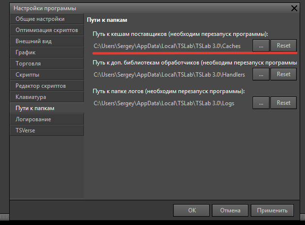

## Содержание

-  [Что такое кэш данных в TSLab](./izmeneniya-v-khranenii-kesha-dannykh-v-tslab-3-0#что-такое-кэш-данных-в-tslab)

-  [Кэш торговых данных: что изменилось](./izmeneniya-v-khranenii-kesha-dannykh-v-tslab-3-0#кэш-торговых-данных:-что-изменилось)

-  [Кэш тиковых данных: что изменилось](./izmeneniya-v-khranenii-kesha-dannykh-v-tslab-3-0#кэш-тиковых-данных:-что-изменилось)

-  [Преимущества нового формата](./izmeneniya-v-khranenii-kesha-dannykh-v-tslab-3-0#преимущества-нового-формата)

-  [Настройка пути хранения кэша](./izmeneniya-v-khranenii-kesha-dannykh-v-tslab-3-0#настройка-пути-хранения-кэша-в-tslab-3#настройка-пути-хранения-кэша-в-tslab-3.0)

-  [Работа с кэшем после миграции из TSLab 2.2](./izmeneniya-v-khranenii-kesha-dannykh-v-tslab-3-0#работа-с-кэшем-после-миграции-из-tslab-2#работа-с-кэшем-после-миграции-из-tslab-2.2)

-  [Важные особенности при работе с кэшем](./izmeneniya-v-khranenii-kesha-dannykh-v-tslab-3-0#важные-особенности-при-работе-с-кэшем)

---

В TSLab 3.0 изменился формат хранения кэша торговых данных. Новая структура улучшает производительность программы и ускоряет загрузку данных. В этой статье подробно рассказываем о том, что изменилось, как работать с новым форматом и как использовать старый кэш из TSLab 2.2.

---

## Что такое кэш данных в TSLab

Кэш данных -- это локальное хранилище торговой информации на компьютере пользователя. Когда вы впервые открываете график инструмента или запускаете скрипт, программа загружает данные с сервера биржи или брокера и сохраняет их в кэше. При последующих обращениях к этому инструменту данные загружаются из кэша, что значительно ускоряет работу программы.

После сохранения данных в кэш вы можете использовать их для разработки и тестирования скриптов даже без подключения к серверу биржи. Программа будет работать с локальными данными, что особенно удобно при отладке торговых алгоритмов.

### В каких папках хранится кэш

Для каждого поставщика данных в TSLab создаются три папки:

**\[НазваниеПоставщика\]Cache** -- кэш торговых данных (интервальные данные для графиков: цены открытия, закрытия, максимумы, минимумы, объёмы)

**\[НазваниеПоставщика\]CacheData** -- служебная информация:

-  Списки инструментов, доступных у данного поставщика

-  База сделок с привязкой к агентам

**\[НазваниеПоставщика\]CacheTrades** -- кэш тиковых данных (каждая отдельная сделка на бирже с точным временем и объёмом)

**Пример для поставщика ByBit USDT Perpetual:**

```
ByBitUSDTPerpetualCache
ByBitUSDTPerpetualCacheData
ByBitUSDTPerpetualCacheTrades
```

---

## Кэш торговых данных: что изменилось

### Кэш в TSLab 2.2

В версии 2.2 все файлы кэша для инструментов хранились непосредственно в папке **Cache**. Для каждой комбинации инструмента и интервала создавался один файл, который содержал все торговые данные за весь период времени.

**Пример структуры:**

```
ByBitUSDTPerpetualCache
    ETHUSDT.1M.bin.gz
    BTCUSDT.1M.bin.gz
    ETHUSDT.1D.bin.gz
    BTCUSDT.5M.bin.gz
```

Где:

-  **ETHUSDT** -- аббревиатура инструмента

-  **1M** -- интервал (1 минута)

-  **bin.gz** -- формат файла (сжатый бинарный)

Один файл мог содержать данные за несколько лет (например, с 2020 по 2026 год). При открытии графика программа загружала весь файл целиком, даже если нужны были данные только за последний месяц.

### Кэш в TSLab 3.0

В версии 3.0 внутри папки **Cache** создаются отдельные подпапки для каждой комбинации инструмента и интервала. Внутри этих подпапок хранятся файлы, разбитые по месяцам.

**Пример структуры:**

```
ByBitUSDTPerpetualCache
    ETHUSDT.1P
        ETHUSDT.2511.1P.bin.gz
        ETHUSDT.2512.1P.bin.gz
        ETHUSDT.2601.1P.bin.gz
    ETHUSDT.1V
        ETHUSDT.2511.1V.bin.gz
        ETHUSDT.2512.1V.bin.gz
    ETHUSDT.1M
        ETHUSDT.2511.1M.bin.gz
        ETHUSDT.2512.1M.bin.gz
        ETHUSDT.2601.1M.bin.gz
    BTCUSDT.1M
        BTCUSDT.2511.1M.bin.gz
        BTCUSDT.2512.1M.bin.gz
```

Где:

-  **ETHUSDT.1P** -- папка для данных по шагу цены инструмента ETHUSDT

-  **ETHUSDT.1V** -- папка для данных по объёму

-  **ETHUSDT.1M** -- папка для минутных данных

-  **2511** -- данные за ноябрь 2025 года (формат ГГММ: год 25, месяц 11)

-  **2512** -- данные за декабрь 2025 года

-  **2601** -- данные за январь 2026 года

### Обозначения интервалов

В названиях папок используются следующие обозначения:

-  **1P** -- шаг цены (Price)

-  **1V** -- объём (Volume)

-  **1S** -- секунды (Seconds)

-  **1M** -- минуты (Minutes)

-  **1D** -- дни (Days)

Цифра перед буквой указывает на количество единиц интервала. Могут использоваться стандартные интервалы: 1, 5, 15, 30.

**Примеры:**

```
ETHUSDT.5M — данные с интервалом 5 минут
ETHUSDT.15M — данные с интервалом 15 минут
ETHUSDT.30S — данные с интервалом 30 секунд
ETHUSDT.1D — дневные данные
```

### Нестандартные таймфреймы

Если в скрипте или на графике используется нестандартный таймфрейм (например, 12 минут или 7 минут), программа будет использовать ближайшее кратное значение для хранения кэша.

**Пример:**

Для таймфрейма **12 минут** будет использоваться папка **ETHUSDT.1M** (данные с интервалом 1 минута). Программа загружает минутные данные и строит из них 12-минутные бары.

---

## Кэш тиковых данных: что изменилось

Тиковые данные -- это информация о каждой отдельной сделке на бирже: время, цена, объём, направление (покупка или продажа).

### Кэш тиковых данных в TSLab 2.2

В версии 2.2 тиковые данные хранились в папке **CacheTrades**. Файлы создавались с привязкой к дате и содержали все тики за день.

**Пример структуры:**

```
ByBitUSDTPerpetualCacheTrades
    BTCUSDT.11.21.2025.bin.gz
    ETHUSDT.11.21.2025.bin.gz
    BTCUSDT.11.22.2025.bin.gz
```

Где дата записывалась в формате **месяц.день.год** (21 ноября 2025 года).

### Кэш тиковых данных в TSLab 3.0

В версии 3.0 изменился формат записи даты в названии файла и добавлена информация о серверном времени.

**Пример структуры:**

```
ByBitUSDTPerpetualCacheTrades
  BTCUSDT
    BTCUSDT.251125.H06.trades.bin.gz
    BTCUSDT.251125.H12.trades.bin.gz
  ETHUSDT
    ETHUSDT.251125.H06.trades.bin.gz    
```

Где:

-  **251125** -- 25 ноября 2025 года (формат ГГММДД: год 25, месяц 11, день 25)

-  **H06** -- серверное время (6 часов утра)

-  **trades** -- маркер тиковых данных

-  **bin.gz** -- формат файла

### Условия создания файлов

Данные по тикам накапливаются в оперативной памяти программы только когда по инструменту запрошены тиковые данные. Файлы с тиками создаются в двух случаях:

1. **При отключении от поставщика данных** -- все накопленные тики сохраняются на диск

2. **По таймеру** -- периодическое сохранение накопленных тиков

Таймер задаётся в настройках поставщика данных в параметре **"Записывать тики, мин"**. По умолчанию установлено значение **240 минут** (4 часа).

---

## Преимущества нового формата

Новый формат хранения данных обеспечивает несколько важных улучшений по сравнению с TSLab 2.2.

### Разбивка на файлы по месяцам

Вместо одного большого файла, содержащего все данные за несколько лет, теперь данные разбиты на отдельные файлы по месяцам. Каждый файл содержит данные только за один календарный месяц. Это позволяет программе загружать только необходимые файлы, а не весь архив целиком.

**Пример:**

Если вы открываете график с отображением данных за последние 3 месяца, программа загрузит только 3 файла вместо одного файла за несколько лет.

### Ускорение загрузки данных

Когда вы открываете график или запускаете скрипт, программа определяет, какой период времени нужен для отображения или расчёта, и загружает из кэша только соответствующие файлы. Это значительно сокращает время загрузки, особенно при работе с большим объёмом исторических данных.

### Улучшение производительности

После проведённых тестов новый формат хранения данных показал лучшую производительность программы в целом. Операции с графиками, скриптами и агентами выполняются быстрее благодаря оптимизированному доступу к данным. Снижена нагрузка на оперативную память, так как программа не держит в памяти весь архив данных, а загружает только необходимые месяцы.

---

## Важные особенности при работе с кэшем

### Конвертация старого кэша в новый формат

Конвертация старого кэша в новый формат происходит при запросе данных по конкретному инструменту.

**Условия для конвертации:**

1\. Старый файл кэша должен находиться в папке поставщика, к которой обращается TSLab 3.0:

-  Для нового поставщика (созданного в TSLab 3.0):

```
C:\Users\User\AppData\Local\TSLab\TSLab 3.0\Caches\[НазваниеПоставщика]Cache
```

-  Для мигрированного поставщика (перенесённого из TSLab 2.2):

```
C:\Users\User\AppData\Local\TSLab\TSLab 2.0\[НазваниеПоставщика]Cache
```

2\. Вы должны запросить данные по инструменту -- открыть график с нужным интервалом или запустить скрипт.

3\. Программа проверит наличие файла в старом формате (например, ETHUSDT.1M.bin.gz) и при его обнаружении выполнит конвертацию.

**Процесс конвертации:**

1. Программа обнаруживает файл в старом формате (например, ETHUSDT.1M.bin.gz)

2. Считывает данные из старого файла

3. Создаёт новую структуру -- папку ETHUSDT.1M с файлами по месяцам внутри

4. Старый файл остаётся на месте без изменений

<note>

**Важно:** После конвертации у вас будут присутствовать оба набора файлов:

-  Старый файл в формате TSLab 2.2 (например, ETHUSDT.1M.bin.gz)

-  Новые файлы в формате TSLab 3.0 (папка ETHUSDT.1M с файлами внутри)

Оба набора содержат одинаковые данные за один и тот же период, что увеличивает занимаемое место на диске.

</note>

**Ограничение:** Программа проверяет наличие старого файла только при первом запросе данных по инструменту. Если по инструменту уже загружены данные в новом формате (существует папка, например, ETHUSDT.1M), программа не будет проверять наличие старого файла при повторных запросах.

### Добавление старого кэша к уже загруженным данным

**Типичная ситуация:**

1. Вы установили TSLab 3.0 и создали нового поставщика данных (не через миграцию)

2. Открыли график по инструменту ETHUSDT с интервалом 1 минута

3. Биржа отдала данные только за последние 30 дней (ограничение API)

4. Программа создала папку ETHUSDT.1M с файлами в новом формате

5. Позже вы вспомнили, что в TSLab 2.2 у вас накоплен кэш за несколько лет

**Проблема:**

Если просто скопировать старый файл ETHUSDT.1M.bin.gz в папку **\[НазваниеПоставщика\]Cache**, программа его проигнорирует, так как по этому инструменту уже существуют данные в новом формате.

**Решение:**

1. Закройте TSLab 3.0. Удалите папку с новыми данными (например, ETHUSDT.1M целиком)

2. Поместите старый файл (ETHUSDT.1M.bin.gz) в папку **\[НазваниеПоставщика\]Cache**

3. Запустите программу. Подключитесь к поставщику данных. Откройте график по инструменту заново и запросите данные

4. Программа обнаружит старый файл и выполнит конвертацию в новый формат

5. Затем программа дозагрузит недостающие новые данные с биржи и добавит их к сконвертированным

### Резервное копирование при большом объёме данных

Если вы выполняли миграцию поставщиков и у вас накоплен большой объём старого кэша (несколько гигабайт), рекомендуется создать резервную копию папки с кэшем перед любыми операциями по переносу, изменению путей или удалению файлов.

**Как создать резервную копию:**

1. Откройте папку: C:\\Users\\User\\AppData\\Local\\TSLab\\TSLab 2.0

2. Найдите папки поставщиков с суффиксами Cache, CacheData, CacheTrades. Например:

   1. ByBitUSDTPerpetualCache

   2. ByBitUSDTPerpetualCacheData

   3. ByBitUSDTPerpetualCacheTrades

3. Скопируйте эти папки в надёжное место (внешний диск, облачное хранилище, другой раздел диска)

Это защитит ваши данные на случай ошибки при ручном переносе или других непредвиденных проблем. Загрузка многолетнего архива данных с биржи может занять значительное время, особенно если биржа ограничивает глубину истории или скорость запросов.

### Что происходит при удалении TSLab 3.0

При удалении TSLab 3.0 файлы кэша торговых данных не затрагиваются.

---

## Настройка пути хранения кэша в TSLab 3.0

### Путь по умолчанию

Программа по умолчанию использует следующий путь для хранения кэша:

```
C:\Users\User\AppData\Local\TSLab\TSLab 3.0\Caches
```

### Как задать новый путь для хранения кэша

Вы можете изменить путь для хранения кэша данных в настройках программы:

1. В главном меню программы выберите **Файл -> Настройки программы**

2. Перейдите на вкладку **Пути к папкам**

3. Задайте новый путь к папке с кешами в строке **Путь к кешам поставщиков (необходим перезапуск программы)**

   {width=629px height=464px}

В настройках задаётся общая папка, в которой будут размещаться папки всех поставщиков данных. Для каждого поставщика автоматически создаются три папки (Cache, CacheData, CacheTrades), а внутри них -- структура по инструментам.

<note>

**Важно:** Путь задаётся один для всех поставщиков данных. Нельзя указать отдельные пути для разных поставщиков или для разных типов данных (интервальные, тиковые).

</note>

### Требования к выбору папки

При выборе папки для хранения кэша рекомендуется учитывать следующее:

**Права доступа:** Выбирайте папку, для которой у вашей учётной записи Windows есть полные права на чтение и запись. Программа должна иметь возможность создавать, изменять и удалять файлы в этой папке.

**Системные папки:** Избегайте использования системных папок Windows (например, Program Files, Windows), так как для записи в них может требоваться запуск программы от имени администратора. Это может привести к проблемам при автоматическом обновлении кэша.

**Свободное место:** Убедитесь, что на диске достаточно свободного места для хранения кэша. Объём зависит от количества инструментов, глубины истории и используемых интервалов. Рекомендуется иметь в запасе минимум 5-10 ГБ свободного места для комфортной работы.

---

## Работа с кэшем после миграции из TSLab 2.2

### Параллельная работа с двумя папками

Если вы выполнили миграцию поставщиков данных из TSLab 2.2, программа будет работать с двумя папками одновременно:

**Для мигрированных поставщиков (из TSLab 2.2):**

Кэш записывается и читается из папки:

```
C:\Users\User\AppData\Local\TSLab\TSLab 2.0
```

**Для новых поставщиков (созданных в TSLab 3.0):**

Кэш записывается и читается из папки, указанной в настройках программы (по умолчанию):

```
C:\Users\User\AppData\Local\TSLab\TSLab 3.0\Caches
```

Это позволяет обеим версиям программы работать с общими данными для старых поставщиков, но использовать отдельное хранилище для новых.

### Структура кэша при миграции

После миграции в папке TSLab 2.0 будут находиться файлы в обоих форматах одновременно.

**Пример структуры:**

```
C:\Users\User\AppData\Local\TSLab\TSLab 2.0\ByBitUSDTPerpetualCache
    ETHUSDT.1M.bin.gz (старый файл из TSLab 2.2) 
    BTCUSDT.1M.bin.gz (старый файл из TSLab 2.2) 
    ETHUSDT.1M (новая папка, создаётся TSLab 3.0) 
        ETHUSDT.2511.1M.bin.gz (новые данные в формате 3.0)
        ETHUSDT.2512.1M.bin.gz
        ETHUSDT.2601.1M.bin.gz
    BTCUSDT.1M (новая папка, создаётся TSLab 3.0)
        BTCUSDT.2511.1M.bin.gz
        BTCUSDT.2512.1M.bin.gz
```

**Как это работает:**

-  TSLab 2.2 видит и использует только старые файлы (ETHUSDT.1M.bin.gz)

-  TSLab 3.0 после конвертации использует только новый формат (папки ETHUSDT.1M с файлами внутри). Старые файлы больше не читаются программой.

Это позволяет обеим версиям программы работать параллельно без конфликтов. TSLab 2.2 продолжает использовать свои файлы, а TSLab 3.0 дополняет их новыми данными в новом формате.

<note>

**Важно:** Весь кэш, накопленный при работе с TSLab 3.0 (новые папки и файлы внутри них), будет недоступен в TSLab 2.2 при обратном переходе. Старая версия программы просто не увидит эти данные.

</note>

### Совместимость форматов и работа со старыми файлами

TSLab 3.0 может читать кэш в старом формате из TSLab 2.2. При первом запросе данных по инструменту программа автоматически конвертирует старые файлы в новый формат.

**Совместимость работает только в одну сторону:**

-  TSLab 3.0 читает и конвертирует кэш TSLab 2.2 -- да

-  TSLab 2.2 читает кэш TSLab 3.0 -- нет

**Что делать со старыми файлами:**

После конвертации старые файлы остаются на месте без изменений. Если вы не планируете возвращаться к TSLab 2.2, у вас есть несколько вариантов:

1. **Удалить старые файлы** для экономии дискового пространства. После конвертации TSLab 3.0 использует только новый формат и не обращается к старым файлам.

2. **Создать резервную копию** старых файлов на другом диске или в облачном хранилище, а затем удалить их с основного диска.

3. **Вручную перенести новые файлы кэша** в директорию TSLab 3.0 для удобства. Это поможет избежать путаницы, где хранятся данные для разных поставщиков -- все данные будут в одной папке, которая указана в настройках программы.

<note type="tip">

**Рекомендация:** Если вы не планируете работать с TSLab 2.2, мы рекомендуем хранить все данные поставщиков в единой папке, указанной в настройках программы (по умолчанию TSLab 3.0\\Caches). К сожалению, мы не можем автоматически перенести данные из папки TSLab 2.0 в TSLab 3.0, поэтому предлагаем сделать это самостоятельно для удобства дальнейшей работы.

Если вы хотите сохранить возможность работы с TSLab 2.2, оставьте старые файлы. TSLab 2.2 не может читать новый формат и будет использовать только свои исходные файлы.

</note>