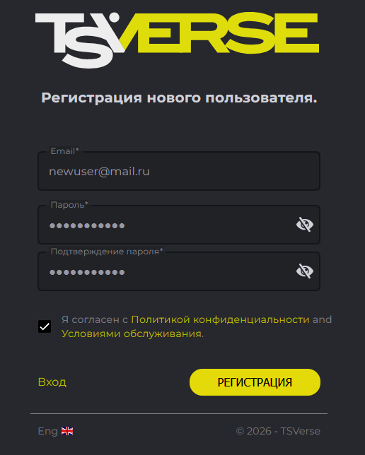
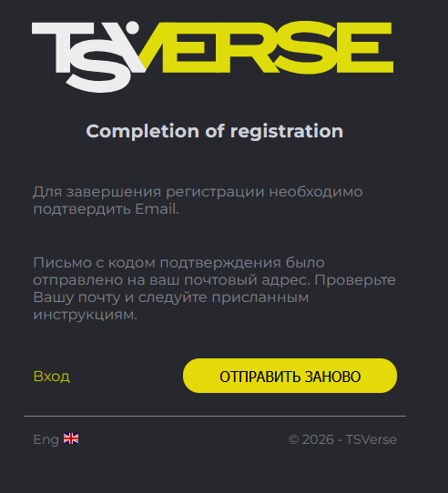
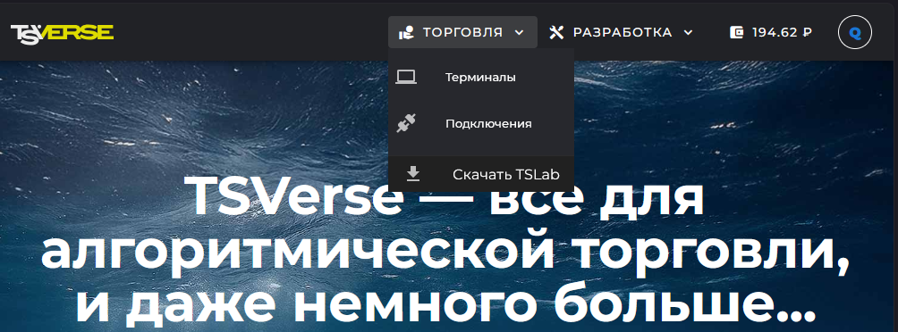

Вместе с TSLab 3.0 мы запустили сервис **TSVerse**, размещённый на сайте [tsverse.ru](https://www.tsverse.ru). Программа и сервис работают в связке: пока вы не вошли в аккаунт TSVerse, основной функционал TSLab 3.0 заблокирован. Поэтому знакомство с новой версией начинается с учётной записи.

Разберём, что умеет сервис, как завести учётную запись и войти в неё и как устроен сайт. Кошелёк и работа с контрактами -- в отдельных статьях, ссылки собраны в конце.

## Что такое TSVerse

Сейчас сервис TSVerse отвечает за работу следующих модулей:

-  **Учётная запись.** Единый аккаунт для сайта и для программы: под ним вы входите и на tsverse.ru, и в TSLab 3.0.

-  **Контракты.** Ваши подписки на тарифные планы поставщиков данных: сервис связывает в контракте учётную запись, выбранный тариф и данные доступа к бирже. Когда вы создаёте поставщика данных, программа запрашивает у TSVerse список ваших активных контрактов -- нужный вы выбираете из этого списка.

-  **Кошелёк.** Лицевой счёт в рублях, с которого оплачиваются все подписки.

-  **Проекты TSChannel.** Каналы связи между торговыми роботами, ключи приёмников и передатчиков.

TSVerse -- новый официальный сайт проекта TSLab и магазин лицензий на тарифные планы. Кабинет на tslab.pro устарел технически и больше не отвечает нашим требованиям к качеству, со временем он будет закрыт.

## Регистрация и вход в учётную запись

Кнопка **Войти** находится в правом верхнем углу сайта. Она ведёт на страницу входа: введите email и пароль и нажмите **Далее**.

{width=1095px height=861px}

<note>

**Если вы уже работали с TSLab, регистрироваться заново не нужно.** Сайты tslab.pro и tsverse.ru работают параллельно и используют одни и те же учётные данные для аккаунта: на новый сайт вы входите тем же email и паролем, что и на старый.

</note>

Новым пользователям нужно зарегистрироваться. На странице входа нажмите **Зарегистрироваться?** и заполните форму: email, пароль и подтверждение пароля. Подтвердите ознакомление с документами -- **Согласие на обработку персональных данных** и **Соглашение об использовании сайта** -- и нажмите **Регистрация**.

{width=516px height=644px}

После этого сервис отправит на указанный адрес письмо со ссылкой подтверждения. Перейдите по ссылке из письма -- регистрация завершена. Если письмо не пришло, нажмите **Отправить заново** на странице завершения регистрации.

{width=492px height=542px}

<note>

Пока адрес не подтверждён, учётная запись не активирована: войти в неё не получится ни на сайте, ни в TSLab 3.0.

</note>

## Как устроен сайт

Отдельного личного кабинета на tsverse.ru нет -- весь сайт и есть кабинет. Всё управление собрано в верхней панели.

-  **Торговля** -> **Подключения** -- ваши контракты: список, свойства, создание и удаление.

-  **Торговля** -> **Скачать TSLab** -- дистрибутив программы.

-  **Разработка** -> **Проекты** -- проекты TSChannel: каналы связи между роботами, приватные ключи и списки приёмников.

-  **Иконка кошелька с балансом** -- текущий баланс и переход на страницу **Баланс и платежи**.

-  **Меню учётной записи** (круглая иконка справа) -- баланс кошелька, **Поддержка**, **Учетная запись**, **Выход**.

{width=1004px height=372px}

В разделе **Учетная запись** хранятся данные профиля: email, телефон и согласие на рассылку новостей TSLab. Здесь же меняется пароль.

## Что дальше

-  **Виртуальный кошелёк TSVerse** -- как пополнить кошелёк, как считается и когда списывается плата за подписки и что происходит при нехватке средств.

-  **Работа с контрактами в TSVerse** -- что такое контракт, какие бывают статусы, что можно сделать в свойствах и как отменить подписку.

-  **Поставщики данных: настройка и подключение** -- как оформить контракт и создать поставщика, не выходя из программы.

-  **Установка и первый запуск. Миграция из TSLab 2.2 в TSLab 3.0** -- что переносится при переходе на новую версию.

Остались вопросы -- напишите нам в поддержку: <https://support.tsverse.pro>