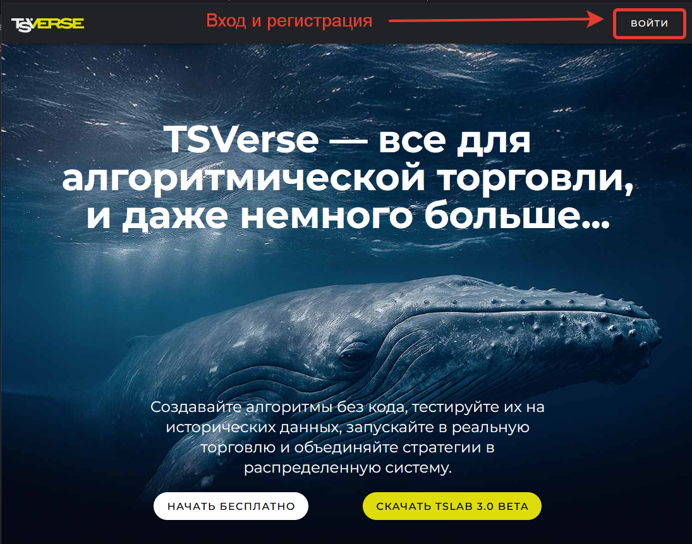
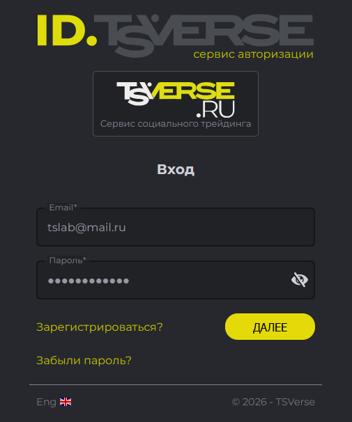
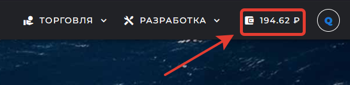
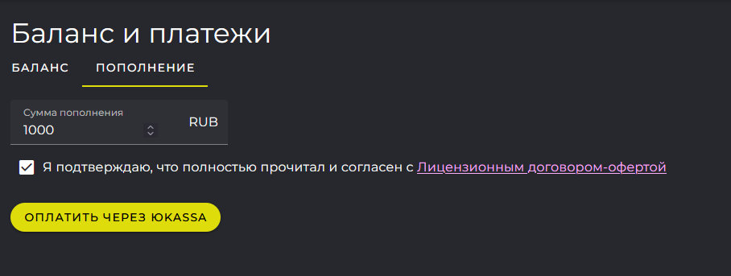
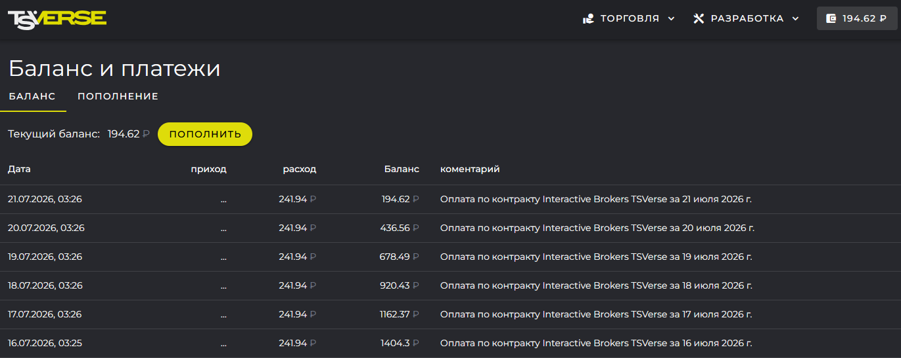
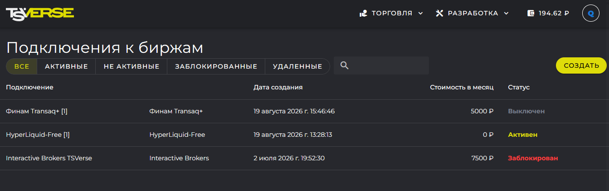
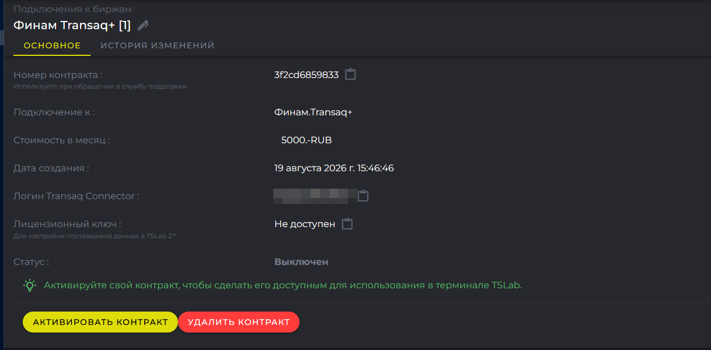

TSVerse - веб-сервис TSLab на сайте [tsverse.ru](https://www.tsverse.ru). Здесь вы регистрируетесь, пополняете счёт, оформляете подписки на тарифные планы и создаёте Проекты, работающие по технологии TSChannel. Здесь же вы видите состояние своих контрактов и историю операций.

TSLab 3.0 работает с сервисом TSVerse в связке: при запуске программа требует входа в аккаунт TSVerse. Поэтому знакомство с новой версией начинается с сайта.

В этой статье разберём, как войти в аккаунт, пополнить кошелёк, по какому правилу списывается плата и где найти свои контракты.

## Вход и регистрация

Сервис работает по адресу [tsverse.ru](https://www.tsverse.ru). Кнопка входа в учётную запись расположена в правом верхнем углу страницы.

{width=1095px height=861px}

Учётные записи старого кабинета tslab.pro перенесены в TSVerse. Если у вас есть учётная запись на tslab.pro, регистрироваться заново не нужно - на странице входа укажите ту же почту и тот же пароль и нажмите **Далее**.

{width=505px height=606px}

<note>

Перенесены только учётные данные. Сведения о контрактах, оформленных в кабинете tslab.pro, в TSVerse не передаются: в новом кабинете вы их не увидите.

</note>

Если учётной записи TSLab у вас ещё нет, пройдите регистрацию.

1. На странице входа нажмите **Зарегистрироваться?**.

2. Укажите почту, задайте пароль и повторите его в поле **Подтверждение пароля**.

3. Отметьте согласие с Политикой конфиденциальности и Условиями обслуживания и нажмите **Регистрация**.

4. Откроется страница с сообщением о том, что для завершения регистрации нужно подтвердить адрес. Откройте письмо и перейдите по ссылке из него. Письмо не пришло - нажмите **Отправить заново**.

{width=516px height=644px}

<note>

Подтвердить почту обязательно: пока адрес не подтверждён, войти в TSLab 3.0 не получится.

</note>

## Кошелёк: как пополнить

***Виртуальный кошелёк*** - внутренний счёт вашей учётной записи в рублях. Это не банковский счёт: средства на нём используются только для оплаты услуг TSVerse. С кошелька оплачиваются подписки на платные тарифные планы поставщиков данных и другие платные услуги сервиса. Отдельно оплачивать каждый контракт, как в кабинете tslab.pro, больше не нужно.

1. Войдите на tsverse.ru и нажмите иконку кошелька в правом верхнем углу. Откроется страница **Баланс и платежи** с вкладками **Баланс** и **Пополнение**.

   {width=585px height=142px}

2. Перейдите на вкладку **Пополнение** и укажите сумму - от 500 до 50 000 рублей. Нажмите **Оплатить через ЮKassa**.

3. Завершите оплату на стороне платёжного сервиса. После оплаты сумма поступит на кошелёк.

{width=908px height=343px}

На вкладке **Баланс** собрана история операций по кошельку: пополнения и списания.

{width=1371px height=547px}

## Как списывается плата

Подписка на тарифный план бессрочная: она действует, пока вы её не отменили и пока на кошельке хватает средств. Продлевать её не нужно.

Плата списывается с кошелька ежедневно, за каждый день использования тарифа. Стоимость дня считается так: месячная стоимость тарифа делится на число календарных дней в текущем месяце - 28, 30 или 31. Поэтому цена дня меняется от месяца к месяцу, и платите вы только за фактически использованные дни.

Например, месячная стоимость тарифного плана - 5000 рублей. В августе 31 день, значит день использования стоит 5000 / 31 = 161,29 рубля. В сентябре дней 30, и день будет стоить 166,67 рубля.

Первое списание проходит при активации контракта. Дальше плата снимается ежедневно после 00:01 по московскому времени.

Месячные цены тарифных планов указаны на витрине: [tsverse.ru/showcase/tslab](https://www.tsverse.ru/showcase/tslab).

### Если средств не хватило

Каждый день сервис списывает с кошелька плату за очередной день использования тарифа. Если средств на оплату не хватает, контракт блокируется сразу: поставщик данных перестаёт работать, торговля через него прекращается. Сам контракт не удаляется - тариф, учётные данные и настройки сохраняются.

О том, что кошелёк пора пополнить, мы предупреждаем заранее письмом на почту вашей учётной записи.

Чтобы возобновить работу, пополните кошелёк. Если вы совершите оплату в тот же день, сервис активирует контракт сам: в течение дня он раз в час проверяет баланс, при достаточной сумме списывает плату и снимает блокировку. Ждать проверки необязательно - контракт можно активировать вручную: откройте его в разделе **Торговля** -> **Подключения** и нажмите **Активировать контракт**.

Если за день контракт так и не активировался, автоматические проверки прекращаются. Дальше активируйте контракт только вручную, тем же способом.

## Работа с контрактами в TSVerse

***Контракт*** - запись в сервисе, которая связывает вашу учётную запись, тарифный план и лицензионный ключ с данными доступа к бирже. Подписку вы оформляете на тарифный план, а контракт создаётся под неё автоматически: именно он определяет, каким поставщиком данных вы пользуетесь и на каких условиях. Как оформить новый контракт, описано в статье о поставщиках данных, а в этом разделе мы рассмотрим, где найти уже созданные контракты и какие свойства у каждого из них.

### Где найти контракты

Все контракты собраны в разделе **Торговля** -> **Подключения**. В списке видно название контракта, поставщика, дату создания, месячную стоимость и текущий статус. Контракты разложены по вкладкам:

-  **Все** - контракты учётной записи независимо от состояния.

-  **Активные** - контракты в работе: поставщик данных подключается, плата списывается ежедневно.

-  **Не активные** - оформленные, но ещё не запущенные контракты, статус **Выключен**.

-  **Заблокированные** - контракты, остановленные сервисом из-за нехватки средств на кошельке.

-  **Удалённые** - контракты, которые вы удалили.

{width=1343px height=423px}

### Свойства контракта

Чтобы открыть свойства контракта, нажмите на строку с его названием. Свойства собраны на вкладке **Основное**:

-  **Номер контракта** - идентификатор, который называют при обращении в поддержку.

-  **Подключение к** - поставщик данных, доступ к которому даёт контракт.

-  **Стоимость в месяц** - цена тарифного плана, из неё считается ежедневное списание.

-  **Дата создания** - когда контракт оформлен.

-  **Счёт** - учётные данные для подключения к бирже.

-  **Лицензионный ключ** - ключ для настройки поставщиков данных в TSLab 2.\*. Значение скрыто, откройте его иконкой с глазом.

-  **Статус** - текущее состояние контракта: **Активен**, **Выключен** или **Заблокирован**.

{width=1218px height=601px}

Значения полей копируются в буфер обмена иконкой рядом. Название контракта и учётные данные можно изменить: нажмите карандаш рядом с полем, введите новое значение и сохраните.

### Как активировать и отменить подписку

После оформления подписки на тарифный план новый контракт появляется на странице **Подключения к биржам**. По бесплатному тарифу он активируется сразу в момент создания, а по платному - создаётся со статусом **Выключен**, и вам необходимо самостоятельно его активировать. Пока контракт находится в этом статусе, он не отображается в списке доступных для подключения в программе. Откройте свойства контракта и нажмите кнопку **Активировать контракт** - в этот момент с виртуального кошелька списывается плата за первый день.

Чтобы отменить подписку, удалите контракт. Приостановить его на время нельзя: пока контракт активен, плата списывается каждый день.

Нажмите **Удалить контракт**. Сервис запросит дополнительное подтверждение и предупредит, что лицензионный ключ будет заблокирован, а абонентская плата перестанет списываться. После подтверждения контракт удаляется, а поставщики данных, работающие по нему в программе, отключаются. Удалённый контракт остаётся в списке на вкладке **Удалённые**.

Плата за текущий день к этому моменту уже списана и не пересчитывается, поэтому удалять контракт разумнее в конце дня - так вы используете оплаченный день полностью.

У заблокированного контракта - того, по которому не хватило средств, - доступны обе кнопки: **Активировать контракт** возвращает его в работу после пополнения кошелька, **Удалить контракт** убирает совсем.

## Что дальше

Вы вошли в аккаунт TSVerse, пополнили кошелёк и знаете, где найти свои контракты. Следующий шаг - установка программы. В следующей статье подробно разобран процесс миграции и переноса данных из TSLab 2.2 в TSLab 3.0. Прочитайте её до установки.

Подробнее: **Установка и первый запуск. Миграция из TSLab 2.2 в TSLab 3.0**

Остались вопросы - будем рады помочь: напишите нам в поддержку <https://support.tsverse.pro>.

А обсудить релиз и поделиться впечатлениями приглашаем в нашу группу в Telegram: <https://t.me/tslabprorugroup>