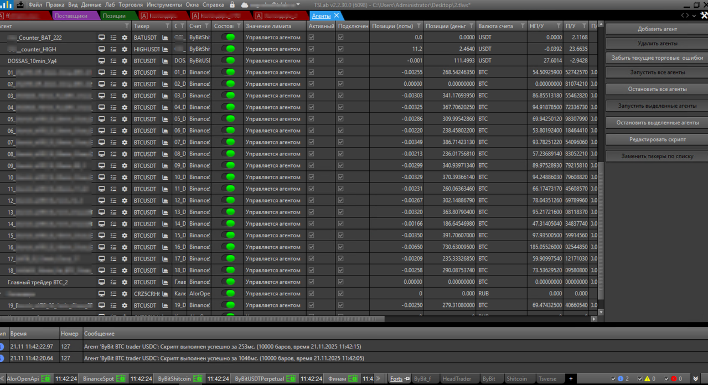
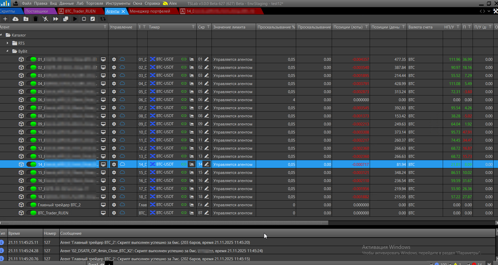
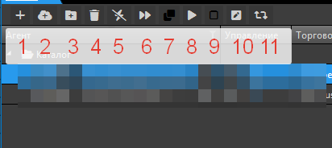
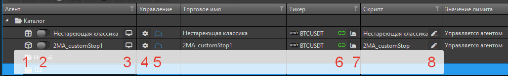

## Содержание

-  [Обзор ключевых изменений](./obnovlennoe-okno-agenty-v-tslab-3-0#обзор-ключевых-изменений)

-  [Сравнение интерфейсов](./obnovlennoe-okno-agenty-v-tslab-3-0#сравнение-интерфейсов)

-  [Основное меню окна](./obnovlennoe-okno-agenty-v-tslab-3-0#основное-меню-окна)

-  [Управление отдельными агентами](./obnovlennoe-okno-agenty-v-tslab-3-0#управление-отдельными-агентами)

---

## Обзор ключевых изменений

В TSLab 3.0 интерфейс окна **Агенты** претерпел значительные изменения для оптимизации рабочего пространства и улучшения навигации.

**Ключевые изменения:**

1. **Оптимизация управления** -- элементы управления перенесены из правой боковой панели в верхнюю часть окна. Текстовые кнопки заменены на компактные иконки для экономии места

2. **Каталоги агентов** -- добавлена возможность создавать каталоги (папки) для группировки агентов по смысловым категориям. Например, можно создать отдельные каталоги для агентов, работающих на разных биржах: РТС, ByBit, Binance. Это упрощает навигацию при работе с большим количеством агентов

### Сравнение интерфейсов

{width=1279px height=696px}

{width=1280px height=684px}

### Основное меню окна

{width=412px height=184px}

**Ключевые элементы:**

1. **Добавить агент** (➕) -- создаёт нового агента на основе скрипта. Скрипт должен быть предварительно создан или добавлен в окне **Скрипты**

2. **Добавить агент из подписки** (☁️) -- создаёт нового агента на основе купленной подписки в TSVerse. Авторы роботов могут выкладывать свои торговые стратегии на сайте TSVerse. Для доступа к стратегии необходимо оформить подписку

3. **Добавить каталог** (📁) -- создаёт новый каталог для группировки агентов. Каталоги можно создавать внутри других каталогов для многоуровневой структуры

4. **Удалить** (🗑️) -- удаляет выбранных агентов. Выбирать несколько агентов можно через **Shift** или **Ctrl**

5. **Забыть текущие торговые ошибки** (⚡) -- позволяет исправить ошибки в работе агента, например пропуск торгового сигнала

6. **Запустить все агенты** (⏩) -- запускает все агенты в окне

7. **Остановить все агенты** (⏹️) -- останавливает все работающие агенты

8. **Запустить выделенные агенты** (▶️) -- запускает только выбранных агентов

9. **Остановить выделенные агенты** (⏸️) -- останавливает только выбранных агентов

10. **Редактировать скрипт** (✏️) -- открывает в редакторе скрипт, на основе которого создан агент

11. **Заменить тикеры по списку** (🔄) -- массовая замена тикеров в выбранных агентах. Используется при экспирации фьючерсов, когда инструмент получает новое название. Замена происходит только в выделенных агентах. Перед заменой обязательно остановите агенты

### Управление отдельными агентами

Для каждого агента в таблице доступны элементы управления и индикаторы состояния.

{width=1028px height=164px}

**Ключевые элементы:**

1. **Тип агента** -- графическое обозначение источника агента: создан из локального скрипта или загружен по подписке из TSVerse

2. **Включение/отключение агента** (слайдер) -- запускает или останавливает работу агента

3. **Открыть окно агента** (💻) -- открывает детальное окно агента с вкладками: График, Результаты, Сделки, Лог, Параметры

4. **Торговые настройки** (⚙️) -- открывает окно настроек торговых параметров агента

5. **Трансляция работы агента** (☁️) -- включает трансляцию работы агента на сайт [tsverse.ru](http://tsverse.ru) (временно не работает)

6. **Индикатор поставщика данных** (цветовой индикатор) -- показывает состояние подключения поставщика данных к бирже.

7. **Открыть график инструмента** (📈) -- открывает график торгового инструмента, на котором работает агент

8. **Редактировать скрипт** (✏️) -- открывает в редакторе скрипт, на основе которого создан агент

---

## Заключение

Благодарим вас за интерес к новой версии программы TSLab 3.0! Мы активно работаем над тестированием и доработкой функционала. В процессе бета-тестирования возможны изменения в интерфейсе описанных окон и добавление новых возможностей.

## Обратная связь и поддержка

**Обсудить TSLab 3.0:**

Присоединяйтесь к обсуждению новой версии в нашей группе Telegram: <https://t.me/tslabprorugroup>

**Техническая поддержка:**

Все вопросы направляйте в службу поддержки: <https://support.tsverse.pro>

Ваши отзывы и предложения помогают нам сделать TSLab лучше!