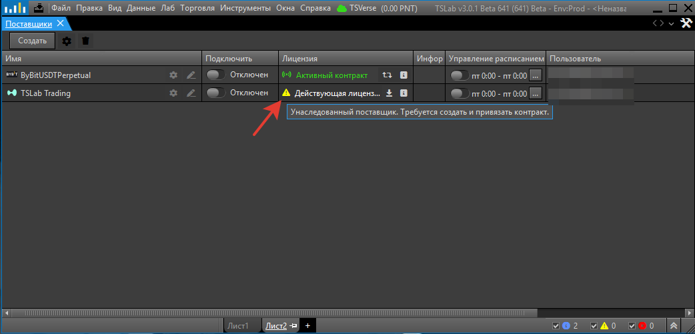
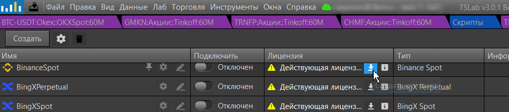
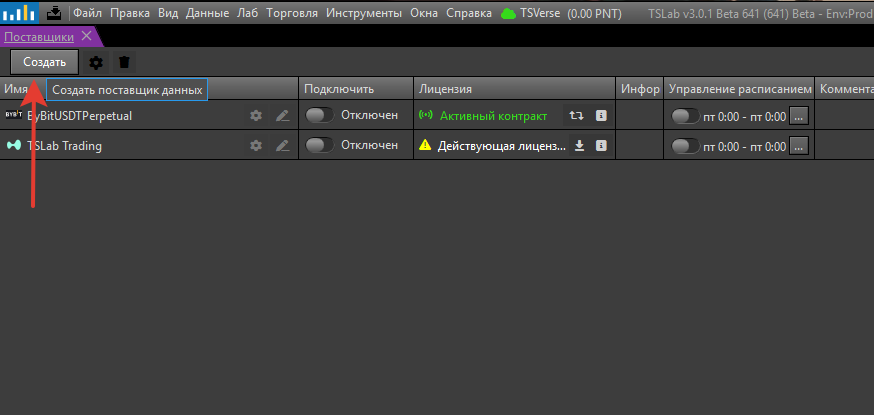
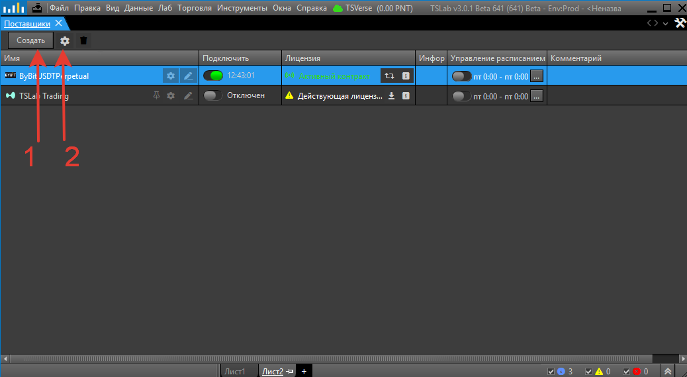
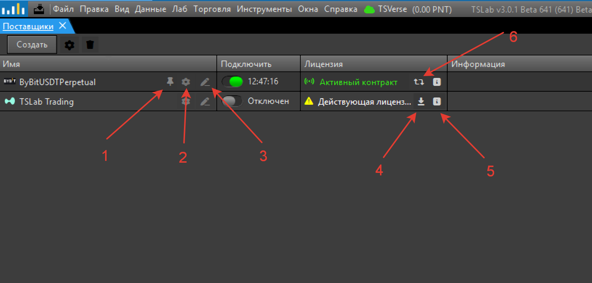

## Содержание

-  [Поставщики после миграции из TSLab 2.2](./rabota-s-postavschikami-dannykh-v-tslab-3-0.md#поставщики-после-миграции-из-tslab-2#поставщики-после-миграции-из-tslab-2.2)

-  [Создание нового поставщика данных](./rabota-s-postavschikami-dannykh-v-tslab-3-0#создание-нового-поставщика-данных)

-  [Изменения в интерфейсе окна Поставщики](./rabota-s-postavschikami-dannykh-v-tslab-3-0#изменения-в-интерфейсе-окна-поставщики)

---

## Поставщики после миграции из TSLab 2.2

### Доступность мигрированных поставщиков

После миграции все поставщики данных из TSLab 2.2 будут доступны в окне **Поставщики** в TSLab 3.0.

### Унаследованные поставщики

У перенесённых поставщиков в столбце **Лицензия** отображается:

-  Значок ⚠️ (жёлтый треугольник с восклицательным знаком)

-  Описание при наведении: *"Унаследованный поставщик. Требуется создать и привязать контракт"*

   {width=1042px height=501px}

<note>

**Важно:** на данном этапе никаких действий не требуется.

-  Ваш контракт, оформленный в личном кабинете [tslab.pro](http://tslab.pro), продолжает работать в TSLab 3.0

-  Поставщик будет функционировать до окончания срока действия текущего контракта

-  **По окончании срока действия ключа** создайте контракт из программы по кнопке **Создать контракт** в поставщике данных

   {width=993px height=220px}

</note>

### Когда потребуется создать новый контракт

➡️**Для бесплатных поставщиков:**

Вы можете сразу перевести контракт на систему TSVerse:

1. В окне **Поставщики** найдите нужного поставщика

2. В столбце **Лицензия** нажмите кнопку **Создать контракт**

3. Следуйте инструкциям системы. Новый контракт будет создан в TSVerse

➡️**Для платных поставщиков:**

1. Дождитесь окончания срока действия текущего тарифного плана в [tslab.pro](http://tslab.pro)

2. Перед созданием нового контракта пополните виртуальный кошелёк TSVerse

3. После пополнения создайте новый контракт через кнопку **Создать контракт**

### Совместимость контрактов

-  Контракты из TSVerse можно использовать в TSLab 2.2

-  Лицензионный ключ доступен в свойствах тарифного плана после оформления подписки на [tsverse.ru](http://tsverse.ru)

-  Это позволяет работать с обеими версиями программы одновременно

## Создание нового поставщика данных

Рассмотрим процесс создания на примере криптобиржи ByBit.

### Подготовка: получение учётных данных

Перед созданием поставщика подготовьте учётные данные для подключения:

-  **Для криптобирж:** API-ключи (Public Key и Secret Key)

-  **Для брокеров:** логин и пароль терминала

### Способ 1: Создание поставщика из программы TSLab

#### Шаг 1. Открытие мастера создания поставщика

1. Откройте окно Поставщики: **Главное меню -> Данные -> Поставщики**

2. Нажмите кнопку **Создать**

   {width=874px height=415px}

#### Шаг 2. Выбор поставщика и тарифа

1. В открывшемся окне выберите вкладку **С созданием контракта**

2. В списке найдите требуемый поставщик данных, например ByBit USDT Perpetual. Нажмите **Далее**

   <image src="./rabota-s-postavschikami-dannykh-v-tslab-3-3.png" crop="0,0,100,100" scale="87" width="800px" height="448px" float="center"/>

3. Выберите тарифный план. Для поставщика данных ByBit доступен бесплатный тарифный план (при соблюдении условий)

4. В поле **Публичный ключ** введите **Public API Key** с биржи ByBit

5. В поле **Название контракта** (необязательно) укажите удобное для вас имя

6. Нажмите **Далее**

   <image src="./rabota-s-postavschikami-dannykh-v-tslab-3-4.png" crop="0,0,100,100" scale="89" width="816px" height="461px" float="center"/>

#### Шаг 3. Настройка поставщика

1. В поле **Имя локального поставщика данных** задайте имя (например, "ByBit Основной")

2. В поле **Секретный API ключ** введите **Secret Key** с биржи ByBit

3. Нажмите **Создать**

   <image src="./rabota-s-postavschikami-dannykh-v-tslab-3-5.png" crop="0,0,100,100" scale="83" width="705px" height="346px" float="center"/>

<note type="tip">

**Что происходит после создания**

-  Автоматически создаётся подписка на тариф в системе TSVerse

-  Списывается оплата за первый день (для платных тарифов)

-  Подписка привязывается к вашему аккаунту

-  Поставщик готов к использованию

</note>

#### Шаг 4. Подключение к бирже

1\. В окне **Поставщики** найдите созданного поставщика

2\. Нажмите кнопку **Подключить** (слайдер)

3\. Дождитесь изменения статуса на 🟢 Зелёный (подключение успешно)

<image src="./rabota-s-postavschikami-dannykh-v-tslab-3-6.png" crop="0,0,100,100" scale="82" width="736px" height="360px" float="center"/>

### Способ 2: Создание поставщика через сайт TSVerse

#### Шаг 1. Оформление подписки на сайте

1. Войдите на сайт [tsverse.ru](http://tsverse.ru)

2. Перейдите: **Торговля -> Подключения**

3. Нажмите **Создать**

   <image src="./rabota-s-postavschikami-dannykh-v-tslab-3-7.png" crop="0,0,100,100" scale="86" width="1088px" height="437px" float="center"/>

4. Выберите поставщика **ByBit-Free** из списка. Нажмите **Далее**

   <image src="./rabota-s-postavschikami-dannykh-v-tslab-3-8.png" crop="0,0,100,100" scale="82" width="1023px" height="956px" float="center"/>

5. Изучите условия тарифа. Нажмите **Далее**

   <image src="./rabota-s-postavschikami-dannykh-v-tslab-3-9.png" crop="0,0,100,100" scale="82" width="1004px" height="947px" float="center"/>

6. Введите **Public API Key** в соответствующее поле. Укажите название контракта (необязательно). Нажмите **Далее.**

   <image src="./rabota-s-postavschikami-dannykh-v-tslab-3-10.png" crop="0,0,100,100" scale="82" width="1010px" height="968px" float="center"/>

7. Нажмите **Активировать контракт** ( для платных тарифов)

   <image src="./rabota-s-postavschikami-dannykh-v-tslab-3-11.png" crop="0,0,100,100" scale="80" width="757px" height="709px" float="center"/>

8. Подписка создана и активирована

#### Шаг 2. Создание поставщика в программе

1. Откройте окно **Поставщики** в TSLab 3.0

2. Нажмите кнопку **Создать**

   <image src="./rabota-s-postavschikami-dannykh-v-tslab-3-12.png" crop="0,0,100,100" scale="83" width="874px" height="415px" float="center"/>

3.  Выберите вкладку **Из существующего контракта**

   <image src="./rabota-s-postavschikami-dannykh-v-tslab-3-13.png" crop="0,0,100,100" scale="82" width="797px" height="452px" float="center"/>

4. В списке найдите созданый контракт. Раскройте список поставщиков данных, которые можно создать из этого контракта. Для примера выберем ByBit USDT Perpetual. Нажмите **Далее**

5. Настройте поставщика:

   1. Задайте название (например, "ByBit Основной")

   2. Введите **Secret Key** с биржи ByBit

   3. Проверьте остальные параметры

      <image src="./rabota-s-postavschikami-dannykh-v-tslab-3-14.png" crop="0,0,100,100" scale="85" width="826px" height="438px" float="center"/>

6. Нажмите **Создать**

7. Подключитесь к бирже через кнопку **Подключить**

   <image src="./rabota-s-postavschikami-dannykh-v-tslab-3-15.png" crop="0,0,100,100" scale="84" width="736px" height="360px" float="center"/>

<note type="lab">

**При проблемах с подключением**

1. Проверьте правильность Public Key в настройках подписки на [tsverse.ru](http://tsverse.ru)

2. Проверьте правильность Secret Key в настройках поставщика в TSLab

3. Убедитесь, что API-ключ на бирже имеет права на чтение и торговлю

4. Проверьте баланс виртуального кошелька (для платных тарифов)

5. Обратитесь в службу поддержки с номером контракта (доступен на [tsverse.ru](http://tsverse.ru) -> Подключения)

</note>

---

## Изменения в интерфейсе окна Поставщики

### Основное меню окна

В TSLab 3.0 изменился интерфейс управления поставщиками данных. Основные изменения касаются кнопок управления в верхней части окна.

{width=1038px height=569px}

**Ключевые элементы:**

**1\. Создать** -- открывает окно **Создать поставщик данных** с тремя вкладками:

-  **Из существующего контракта** -- отображает список всех контрактов пользователя в TSVerse. Контракты представлены в виде свёрнутого списка. При нажатии на стрелочку рядом с названием контракта раскрывается список поставщиков, которые можно создать из этого контракта. После выбора нажмите **Далее** для создания поставщика

-  **С созданием контракта** -- показывает список всех доступных поставщиков в программе. После выбора нужного поставщика данных пользователь переходит к процедуре создания контракта в программе с последующим созданием поставщика

-  **Из исторических данных** -- для работы с текстовыми поставщиками данных

**2\. Настройки** (⚙️) -- открывает настройки выбранного поставщика

### Управление отдельными поставщиками

Для каждого поставщика в списке доступны дополнительные функции управления.

{width=1280px height=614px}

**Ключевые элементы:**

1. **Закрепить** (📌) -- добавляет кнопку включения/отключения поставщика в строку состояния (нижняя панель программы, где расположены переключение между листами и журнал сообщений)

2. **Настройки** (⚙️) -- открывает настройки поставщика

3. **Изменить пользовательское имя поставщика** (✏️) -- открывает окно для изменения названия поставщика в программе. Имя в других окнах обновится только после перезагрузки программы

4. **Создать контракт** (⬇️) -- отображается для поставщиков, мигрировавших из TSLab 2.2. При нажатии создаётся новый контракт в магазине TSVerse. Для платных тарифов убедитесь, что виртуальный кошелёк TSVerse пополнен

5. **Информация о лицензии** (ℹ️) -- показывает тип контракта, статус, публичный API-ключ (логин) и ключ лицензии

6. **Изменение учётных данных** (🔄) -- открывает окно для изменения учётных данных контракта

### Изменение учётных данных

Один контракт может использоваться для создания нескольких поставщиков данных, в том числе на разных компьютерах. В окне **Изменение учётных данных** можно изменить:

**Публичный API-ключ (логин):**

-  Изменения сохраняются на сервере TSVerse

-  Автоматически применяются ко всем поставщикам, созданным из этого контракта

-  В том числе на других компьютерах

**Секретный API-ключ (пароль):**

-  Изменения применяются только к поставщикам на текущем компьютере

-  На других компьютерах секретный ключ необходимо изменить вручную

-  TSVerse не хранит секретные API-ключи (пароли) на сервере

### Статус контракта

В столбце **Лицензия** отображается информация о статусе контракта при подключении к TSVerse:

-  **Активный** -- контракт действует, списание происходит регулярно

-  **Завершённый** -- контракт отменён или истёк срок действия

### Отличия от TSLab 2.2

В TSLab 2.2 для управления лицензиями использовалась кнопка **Ключ**, в которую нужно было вручную вводить лицензионный ключ из личного кабинета [tslab.pro](http://tslab.pro). В TSLab 3.0 эта система заменена на контракты в TSVerse -- лицензия автоматически привязывается к аккаунту при создании поставщика или контракта.

---

## Что дальше?

После настройки поставщиков данных можно переходить к работе с агентами.

**Следующий шаг:** [Обновлённое окно Агенты в TSLab 3.0](./obnovlennoe-okno-agenty-v-tslab-3-0)

**Предыдущий шаг:** [Установка TSLab 3.0 и миграция данных](./ustanovka-tslab-3-0-i-migraciya-dannykh)

---

## Обратная связь и поддержка

**Обсудить TSLab 3.0:**

Присоединяйтесь к обсуждению новой версии в нашей группе Telegram: <https://t.me/tslabprorugroup>

**Техническая поддержка:**

Все вопросы направляйте в службу поддержки: <https://support.tsverse.pro>

Ваши отзывы и предложения помогают нам сделать TSLab лучше!