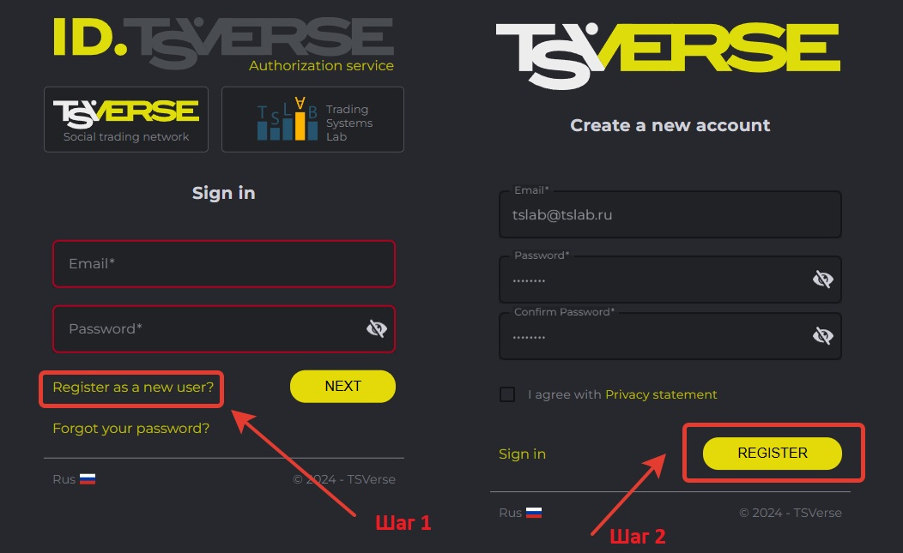
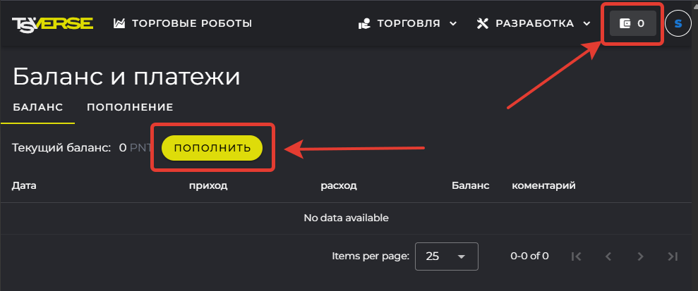
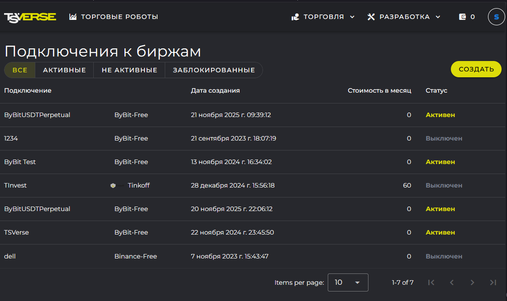

## Содержание

-  [Регистрация на сайте TSVerse](./servis-tsverse-novaya-sistema-podpisok#регистрация-на-сайте-tsverse)

-  [Изменения в системе подписок](./servis-tsverse-novaya-sistema-podpisok#🆕изменения-в-системе-подписок)

-  [Пополнение баланса и управление подписками](./servis-tsverse-novaya-sistema-podpisok#💵пополнение-баланса-и-управление-подписками)

---

## Регистрация на сайте TSVerse

Для работы с TSLab 3.0 требуется обязательная регистрация на сайте проекта TSVerse: [tsverse.ru](http://tsverse.ru).

### Для активных пользователей TSLab

Если вы уже зарегистрированы на старом сайте TSLab ([tslab.pro](http://tslab.pro)), то ваш аккаунт автоматически доступен на TSVerse. Используйте те же учётные данные для входа -- оба сайта работают с общей базой пользователей.

### Для новых пользователей

Перейдите на сайт проекта TSVerse - [tsverse.ru](http://tsverse.ru) и пройдите регистрацию:

-  Нажмите на кнопку **Войти** в правом верхнем углу.

   <image src="./servis-tsverse-novaya-sistema-podpisok.png" crop="0,0,98.78048780487805,100" width="1651px" height="590px" float="center"/>

-  В открывшемся окне выберите пункт **Register as a new user?**.

-  На следующем шаге введите ваш email и пароль для аккаунта. Нажмите на кнопку **Register**.

   {width=1052px height=645px}

-  Дождитесь, когда на указанный адрес придет письмо с подтверждением. Подтвердите ваш email-адрес

После регистрации вы можете приступить к установке и настройке программы TSLab 3.0

## Изменения в системе подписок

### TSLab (старая система на [tslab.pro](http://tslab.pro))

-  Подписка оформлялась на фиксированный срок: 1, 2 или 3 месяца

-  При оформлении сразу выписывался лицензионный ключ

-  Ключ необходимо было вводить вручную в программе для активации поставщика данных

-  По окончании срока подписку требовалось продлевать вручную или через автопродление

-  Оплата производилась единовременно за весь период

### TSVerse (новая система на [tsverse.ru](http://tsverse.ru))

-  Подписка оформляется бессрочно. Пользователь может самостоятельно отменить подписку на сайте [tsverse.ru](http://tsverse.ru)в разделе **Торговля -> Подключения**

-  Оплата производится через виртуальный кошелёк в Поинтах (внутренняя валюта TSVerse). Пополнение производится в рублях на сайте [tsverse.ru](http://tsverse.ru) в разделе **Баланс и платежи**

-  Списание происходит ежедневно за каждый день использования тарифа

-  **Расчёт стоимости дня:** месячная стоимость тарифа делится на количество календарных дней в текущем месяце (28, 30 или 31). Стоимость тарифа фиксируется на момент оплаты. Вы платите только за фактически использованные дни

-  Первое списание происходит при активации подписки, последующие -- ежедневно в начале суток (после 00:00 GMT+0)

-  Лицензионный ключ не требуется -- подписка автоматически привязывается к вашему аккаунту

-  Оформление подписки: на сайте TSVerse или напрямую из программы TSLab

## Пополнение баланса и управление подписками

### Виртуальный кошелёк TSVerse

Для оформления подписок на платные тарифные планы для поставщиков данных в TSLab, а так же для оформления других платных услуг сервиса TSVerse необходимо приобрести внутреннюю валюту сервиса - поинты.

-  Для пополнения кошелька перейдите на [tsverse.ru](http://tsverse.ru)

-  Нажмите на иконку кошелька в правом верхнем углу

-  Перейдите на вкладку **Пополнение**

   {width=989px height=413px}

-  Укажите сумму в рублях -- система автоматически рассчитает количество поинтов

-  Оплатите через платёжный сервис ЮKassa

⚠️**Валюта кошелька:** поинты (PNT) -- внутренняя валюта TSVerse, используется только для оплаты услуг

### Управление подписками на тарифные планы

Раздел подписок на тарифные планы для поставщиков данных в TSLab находится: [**tsverse.ru**](http://tsverse.ru) **-> Торговля -> Подключения**.

{width=1120px height=666px}

Здесь вы можете:

-  Создавать новые подписки на тарифные планы

-  Просматривать активные подписки

-  Управлять неактивными и заблокированными подписками

-  Отменять подписки вручную

-  Для каждой подписки доступна информация: номер контракта, тариф, статус, дата создания

---

## Что дальше?

После регистрации и знакомства с системой подписок можно переходить к установке программы.

-  **Следующий шаг:** [Установка TSLab 3.0 и миграция данных](./ustanovka-tslab-3-0-i-migraciya-dannykh)

-  **Предыдущий шаг:** [Знакомство с TSLab 3.0 Beta](./_index)

---

## Обратная связь и поддержка

**Обсудить TSLab 3.0:**

Присоединяйтесь к обсуждению новой версии в нашей группе Telegram: <https://t.me/tslabprorugroup>

**Техническая поддержка:**

Все вопросы направляйте в службу поддержки: <https://support.tsverse.pro>

Ваши отзывы и предложения помогают нам сделать TSLab лучше!