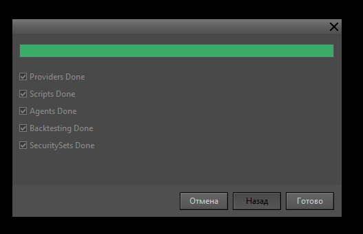

## Содержание

-  [Подготовка к установке](./ustanovka-tslab-3-0-i-migraciya-dannykh#подготовка-к-установке)

-  [Скачивание и установка](./ustanovka-tslab-3-0-i-migraciya-dannykh#скачивание-и-установка)

-  [Первый вход в программу](./ustanovka-tslab-3-0-i-migraciya-dannykh#первый-вход-в-программу)

-  [Миграция данных из TSLab 2.2](./ustanovka-tslab-3-0-i-migraciya-dannykh.md#миграция-данных-из-tslab-2#миграция-данных-из-tslab-2.2)

-  [Настройка рабочего пространства](./ustanovka-tslab-3-0-i-migraciya-dannykh#настройка-рабочего-пространства)

-  [Важно: изменения в хранении данных](./ustanovka-tslab-3-0-i-migraciya-dannykh#⚠️важно:-изменения-в-хранении-данных)

---

## Подготовка к установке

1. Рекомендуется создать резервную копию данных в TSLab 2.2:

   1. Откройте TSLab 2.2

   2. Главное меню -> Инструменты -> Резервная копия данных

2. Закройте все открытые окна с редактором скриптов (визуальный редактор) в TSLab 2.2

3. Завершите работу TSLab 2.2 (полностью закройте программу)

### Скачивание и установка

1. Скачайте установочный файл TSLab 3.0 Beta: [TSLab30BetaSetup.exe](https://files.tslab.pro/beta/TSLab30BetaSetup.exe)

2. Запустите скачанный файл

3. Следуйте инструкциям мастера установки

4. Дождитесь завершения установки

5. Запустите установленную программу TSLab 3.0

### Первый вход в программу

После запуска TSLab 3.0 откроется главное окно программы, но большая часть функционала будет недоступна до авторизации в TSVerse. В центре окна программы отобразится текст: "**Для продолжения работы, пожалуйста выполните Вход**". Слово **Вход** подчёркнуто -- это активная ссылка.

<image src="./ustanovka-tslab-3-0-i-migraciya-dannykh.png" crop="0,0,100,100" scale="90" width="1096px" height="816px" float="center"/>

1. Нажмите на слово **Вход**. Откроется окно браузера со страницей авторизации TSVerse

2. Введите свой email-адрес и пароль от аккаунта TSVerse. Подтвердите вход

3. Вернитесь в программу TSLab 3.0 -- функционал будет разблокирован

### Миграция данных из TSLab 2.2

Если на вашем компьютере установлен TSLab 2.2, то после успешной авторизации в TSLab 3.0 автоматически откроется окно миграции данных. Программа предложит перенести данные из TSLab 2.2 в TSLab 3.0

<image src="./ustanovka-tslab-3-0-i-migraciya-dannykh-2.png" crop="0,0,100,100" scale="91" width="1102px" height="815px" float="center"/>

При согласии будут перенесены:

-  Все агенты

-  Все скрипты

-  Все поставщики данных

-  Кэш торговых данных

Нажмите кнопку **Далее** для начала миграции. Дождитесь завершения процесса. По окончании отобразится статистика переноса

{width=527px height=341px}

#### Если миграция не требуется

Нажмите на кнопку **Отмена**. Можно начать работу с чистой конфигурацией.

### Настройка рабочего пространства

После завершения миграции рекомендуется создать отдельный файл конфигурации окон для TSLab 3.0:

1. Откройте **Главное меню -> Файл -> Сохранить как...**

2. Создайте новую конфигурацию с именем, например, "TSLab 3.0 Beta"

3. Сохраните конфигурацию

4. Настройте расположение окон под свои задачи

## ⚠️Важно: изменения в хранении данных

### Расположение данных программы

TSLab 3.0 создаёт отдельную папку для своей базы данных и настроек:

-  Путь: ***C:\\Users\\User\\AppData\\Local\\TSLab\\TSLab 3.0***

### Совместное использование данных с TSLab 2.2

-  Если TSLab 2.2 установлена на компьютере, то по умолчанию TSLab 3.0 обращается к данным и кэшам из директории: ***C:\\Users\\User\\AppData\\Local\\TSLab\\TSLab 2.0*** 

   Обе версии программы будут работать данными из этой директории. Изменить расположение файлов для TSLab 3.0 можно в настройках программы. 

   Перейдите в пункт главного меню Файл **-> Настройки программы** и выберите вкладку **Пути к файлам.** Укажите каталог для хранения файлов программы.

-  Если TSLab 2.2 не установлена, то TSLab 3.0 использует собственную директорию: ***C:\\Users\\User\\AppData\\Local\\TSLab\\TSLab 3.0***

### Изменения в формате хранения кэшей торговых данных

➡️TSLab 2.2 (старый формат):

<note type="quote">

*C:\\Users\\User\\AppData\\Local\\TSLab\\TSLab 2.0\\\[DataProvider\]Cache*

*\\── ETHUSDT.1M.bin.gz*

</note>

➡️TSLab 3.0 (новый формат):

<note type="quote">

*C:\\Users\\User\\AppData\\Local\\TSLab\\TSLab 2.0\\\[DataProvider\]Cache*

*\\── ETHUSDT.1M/*

*\\── ETHUSDT.2511.1M.bin.gz*

</note>

Где:

-  **1M** -- интервал (1 минута)

-  **2511** -- данные за ноябрь 2025 года

Данные в файлах группируются по месяцам.

### Особенности совместимости при поочерёдной работе с TSLab 2.2 и 3.0

-  Данные за одни и те же дни будут записываться в разные файлы

-  TSLab 3.0 **может читать** кэши из формата TSLab 2.2

-  TSLab 2.2 **не может читать** кэши из нового формата TSLab 3.0

При необходимости вы можете поместить файлы в старом формате в директорию ***\[DataProvider\]Cache*** и TSLab 3.0 сможет их прочесть.

---

## Что дальше?

После установки необходимо настроить поставщики данных для подключения к биржам и брокерам.

**Следующий шаг:** [Работа с поставщиками данных в TSLab 3.0](./rabota-s-postavschikami-dannykh-v-tslab-3-0)

**Предыдущий шаг:** [Сервис TSVerse. Новая система подписок](./servis-tsverse-novaya-sistema-podpisok)

---

## Обратная связь и поддержка

**Обсудить TSLab 3.0:**

Присоединяйтесь к обсуждению новой версии в нашей группе Telegram: <https://t.me/tslabprorugroup>

**Техническая поддержка:**

Все вопросы направляйте в службу поддержки: <https://support.tsverse.pro>

Ваши отзывы и предложения помогают нам сделать TSLab лучше!