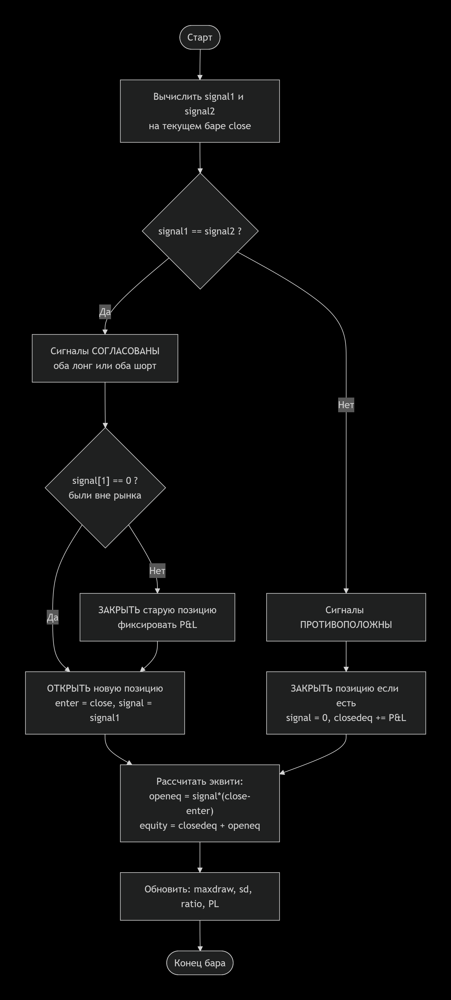

1. Общая идея стратегии

Стратегия  берёт сигналы от **двух независимых систем** и торгует только тогда, когда **обе системы согласны** с направлением сделки.

Если системы дают **разные сигналы** -> позиция закрывается (выход из рынка).

---

## 2\. Какие индикаторы можно использовать для систем

В оригинале пользователь может выбрать для **System 1** и **System 2** один из четырёх типов сигналов:

1. **Moving average (MA)** -- скользящая средняя.

2. **Exponential smoothing (EXP)** -- экспоненциальное сглаживание.

3. **Linear Regression slope (LRS)** -- наклон линейной регрессии.

4. **N-day breakout (NDB)** -- пробой за N дней.

Сигнал определяется **направлением тренда**, а не пересечением цены линии.

---

## 3\. Как торгует каждая система по отдельности

Каждая система:

-  Всегда в рынке (длинная или короткая).

-  При смене сигнала фиксирует прибыль/убыток:

   -  Закрывает старую позицию (расчёт P&L).

   -  Открывает новую позицию по текущей цене.

-  Считает:

   -  Количество сделок, прибыльных сделок.

   -  Эквити (закрытая + открытая прибыль).

   -  Стандартное отклонение изменения эквити (риск).

   -  Максимальную просадку (drawdown).

   -  Отношение прибыли к риску (equity / SD).

---

## 4\. Как объединяются две системы

**Главный механизм объединения:**

-  Если **сигнал1 = сигнал2** (оба = 1 -> лонг, оба = -1 -> шорт):

   -  Закрываем противоположную позицию (если была).

   -  Открываем позицию в согласованном направлении.

-  Если **сигнал1 ≠ сигнал2**:

   -  Закрываем текущую позицию (выход из рынка).

   -  Сигнал становится 0 (нет позиции).

То есть **комбинированная система торгует только когда есть консенсус**.

---

## 5\. Расчёт combined-эквити и рисков

Для объединённой системы считаются:

-  Общее эквити (closedeq + openeq).

-  Просадка (maxdraw).

-  Стандартное отклонение (sd).

-  Коэффициент PL = эквити / maxdraw × 100.

-  Коэффициент ratio = эквити / sd.

---

## 6\. Дополнительные показатели для сравнения

В конце стратегия выводит **сравнение**:

-  **chgdraw** -- насколько уменьшилась просадка объединённой системы по сравнению с лучшей из двух (в %).

-  **chgsd** -- насколько уменьшилось стандартное отклонение (риск) в процентах.

-  **same** -- процент дней, когда обе системы были согласны (сигналы совпадали).

---

## 7\. Что в итоге получается

-  Отдельные показатели для System 1, System 2.

-  Показатели для объединённой системы.

-  Процентное улучшение по просадке и риску, процент совпадения сигналов.

---

## 8\. Важные замечания

-  Стратегия **не ищет точки входа** сама по себе -- она полагается на сигналы внешних индикаторов (TSMMAsignal и т.д.).

-  Код **неполный**: отсутствуют определения этих сигнальных функций.

-  Она предназначена для **тестирования и сравнения**, а не для реальной торговли без адаптации.

-  Комиссия `commission` задана 100 (вероятно, долларов на сделку) -- очень высокая, что критично для частых стратегий.

{width=2210px height=4900px}

### Описание получившейся стратегии CODEX GPT-5.4

1. Название стратегии

-  Русское название: Комбинация двух систем TSM

-  Оригинальное название: `TSM 2-Systems`

## 2\. Автор и источник

-  Автор идеи: Перри Кауфман

-  Исходный материал: `TSM 2 Systems (S)`

## 3\. Краткая идея стратегии

Это трендовая стратегия-перекрестная проверка. Вместо одного сигнального механизма она использует две независимые подсистемы и торгует только тогда, когда обе дают одинаковое направление.

Смысл оригинала:

-  отдельно посчитать сигналы и equity двух систем

-  затем оценить, улучшает ли их комбинация общую кривую капитала и просадку

В текущей реализации TSLab сохранены обе части:

-  реальная торговля по объединенному сигналу

-  аналитические ряды `equity1`, `equity2`, `equityCombined`, `samePct`, `chgDraw`

## 4\. Используемые данные и таймфрейм

Текущая серверная реализация в TSLab:

-  источник данных: `BingXSpot`

-  инструмент: `BTC-USDT`

-  базовый таймфрейм: `D1`

-  диапазон последнего проверочного запуска: с `2023-06-01` по `2026-05-11`

Серверный скрипт:

```
AI/KaufmanStrategies/TSM 2-Systems
```

## 5\. Рассчитываемые индикаторы и ряды

### Подсистема 1

Используются стандартные блоки:

-  `SMA`

-  `EMA`

-  `Highest`

-  `Lowest`

Используется проектный пользовательский индикатор:

-  `KaufmanLinearRegressionLine`

Формульные ряды:

-  `maSig1`

-  `emaSig1`

-  `lrsSig1`

-  `ndbSig1`

-  `signal1`

Трактовка:

-  для `SMA`, `EMA` и `KaufmanLinearRegressionLine` сигнал берется по направлению линии

-  для N-day breakout сигнал удерживается до противоположного пробоя диапазона

### Подсистема 2

Полностью повторяет архитектуру первой подсистемы:

-  `maSig2`

-  `emaSig2`

-  `lrsSig2`

-  `ndbSig2`

-  `signal2`

### Комбинированная часть

-  `combinedSignal`

-  `combinedLongEntry`

-  `combinedShortEntry`

-  `longExitEq`

-  `shortExitEq`

### Аналитические ряды

-  `equity1`

-  `equity2`

-  `equityCombined`

-  `maxDraw1`

-  `maxDraw2`

-  `maxDrawCombined`

-  `samePct`

-  `chgDraw`

## 6\. Правила входа в длинную позицию

Лонг открывается, когда:

-  `signal1 = 1`

-  `signal2 = 1`

-  на предыдущем баре `combinedSignal` еще не был равен `1`

Технически вход реализован лимитным блоком `OpenPositionAtLimitItem` по цене текущего `close`, чтобы сохранить смысл входа на баре сигнала и убрать предупреждение про чисто market-entry граф.

## 7\. Правила входа в короткую позицию

Шорт открывается, когда:

-  `signal1 = -1`

-  `signal2 = -1`

-  на предыдущем баре `combinedSignal` еще не был равен `-1`

Технически вход также реализован через `OpenPositionAtLimitItem` по цене текущего `close`.

## 8\. Начальный стоп-лосс

В исходнике отдельный авторский стоп не описан.

В текущей реализации добавлены инженерные защитные стопы:

-  для лонга: `longProtectStop = min(lowest1[-1], lowest2[-1])`

-  для шорта: `shortProtectStop = max(highest1[-1], highest2[-1])`

Это не буквальное правило источника, а проектное защитное дополнение для рабочей серверной стратегии.

## 9\. Сопровождение позиции

Позиция сопровождается двумя механизмами:

1. рыночное закрытие по потере согласия между двумя подсистемами

2. защитный выход по стоп-уровню, построенному на экстремумах рабочих окон двух систем

Трейлинг в исходном авторском смысле отдельно не вводился.

## 10\. Правила выхода

### Выход из лонга

Лонг закрывается, если:

-  `combinedSignal != 1`

Дополнительно действует защитный стоп `protectLong`.

### Выход из шорта

Шорт закрывается, если:

-  `combinedSignal != -1`

Дополнительно действует защитный стоп `protectShort`.

## 11\. Манименеджмент и размер позиции

Размер позиции в текущем рабочем графе фиксирован:

-  `Shares = 1`

Отдельный авторский риск-менеджмент в исходнике не дан.

Комиссия в реальной торговой ветке:

-  блок `RelativeCommission`

-  `CommissionPct = 0.05`

Для аналитических equity-рядов исходный смысл сохранен через отдельную служебную константу:

-  `commissionCash = 100`

## 12\. Используемые индикаторы и параметры

Пользовательские индикаторы из папки `Indicators`:

-  `KaufmanLinearRegressionLine`

Основные блоки:

-  `SMA`

-  `EMA`

-  `KaufmanLinearRegressionLine`

-  `Highest`

-  `Lowest`

-  `RelativeCommission`

-  `DoubleCustomHandlerItem`

-  `BoolCustomHandlerItem`

-  `OpenPositionAtLimitItem`

-  `ClosePositionByMarketItem`

-  `ClosePositionByStopItem`

Параметры, выведенные на `Controls`:

-  `SysType1`

-  `SysType2`

-  `P1 SMA`

-  `P1 EMA`

-  `P1 LR`

-  `P1 High`

-  `P1 Low`

-  `P2 SMA`

-  `P2 EMA`

-  `P2 LR`

-  `P2 High`

-  `P2 Low`

-  `CommissionPct`

## 13\. Диапазоны параметров для оптимизации

В графе присутствуют автоматические optimization mappings для числовых параметров.

Практически разумно оптимизировать:

-  выборы периодов первой подсистемы

-  выборы периодов второй подсистемы

-  при необходимости `CommissionPct`

Переключатели `SysType1` и `SysType2` удобнее использовать как режимы перебора вариантов системы, а не как обычные тонкие числовые параметры.

## 14\. Неоднозначности и места для проверки

-  В исходнике скрыты внутренние функции `TSMMAsignal`, `TSMEXPsignal`, `TSMLRSsignal`, `TSMNDBsignal`. В TSLab они воспроизведены инженерно по торговому смыслу, а не через идентичный исходный код этих функций.

-  Внешний host-handler `LinearRegression_h` был заменен на собственный проектный индикатор `KaufmanLinearRegressionLine`, потому что в проекте отсутствовали исходники внешней библиотеки, а оставлять такую зависимость по правилам проекта нельзя.

-  Для `SMA`, `EMA` и линейной регрессии использована трактовка "по направлению линии", а не по пробою цены через линию. Это соответствует тексту источника.

-  Для breakout-сигнала используется удержание последнего направления до противоположного пробоя предыдущего диапазона.

-  Защитные стопы добавлены как инженерное расширение, потому что исходник описывает главным образом комбинаторику сигналов и аналитику, а не полный защитный trading shell.

-  В текущем серверном прогоне экономика стратегии отрицательная. Это означает, что перенос структурно рабочий, но торговое качество по текущему инструменту и настройкам не подтверждено.

## Проверка текущей реализации

Последний серверный цикл на текущем артефакте:

-  `authoring-quality`: clean по блокирующим пунктам, `controlPaneCount = 1`

-  `validate`: успешно

-  `build`: успешно

-  `load`: успешно

-  `run`: успешно

## Итог

Стратегия полностью перенесена в серверный визуальный редактор TSLab как рабочий exact-артефакт с:

-  двумя независимыми сигнальными подсистемами

-  объединенным торговым сигналом

-  комиссией

-  защитными выходами

-  контрольной панелью

-  визуализацией

-  аналитическими equity-ветками

## Загрузка скрипта в программу

Скрипт использует пользовательские индикаторы, которых нет в стандартной поставке TSLab. Перед загрузкой скрипта установите дополнительную библиотеку.

### Установка дополнительных индикаторов

1. Скачайте файл `TSLabIndicators.dll` из папки `dist` в репозитории [TSLab Indicators](https://github.com/nagvalru/TSLab-Indicators).

2. Откройте TSLab. Перейдите в **Файл** -> **Настройки программы** -> **Пути к папкам**. Найдите параметр **Путь к доп.библиотекам обработчиков** -- это путь к папке `Handlers`.

3. Откройте эту папку в проводнике Windows, если папки нет - создайте её.

   И скопируйте в неё файл `TSLabIndicators.dll`.

4. Перезапустите TSLab.

### Способ 1. Загрузка с сервера

1. Откройте **Лаб** -> **Скрипты**.

2. На боковой панели нажмите **Загрузить скрипт с сервера**.

3. В дереве папок раскройте **Академия TSLab** -> **Примеры скриптов Kaufman**. Выберите скрипт **Динамическая система пробоя на основе волатильности** и нажмите **Download**.

### Способ 2. Загрузка из файла

1. Скачайте файл скрипта: [2-System.tscript](<TSM 2-Systems.tscript>)

2. Откройте **Лаб** -> **Скрипты**.

3. На боковой панели нажмите **Загрузить из файла** и выберите скачанный файл.

Скрипт появится в списке окна **Скрипты**.