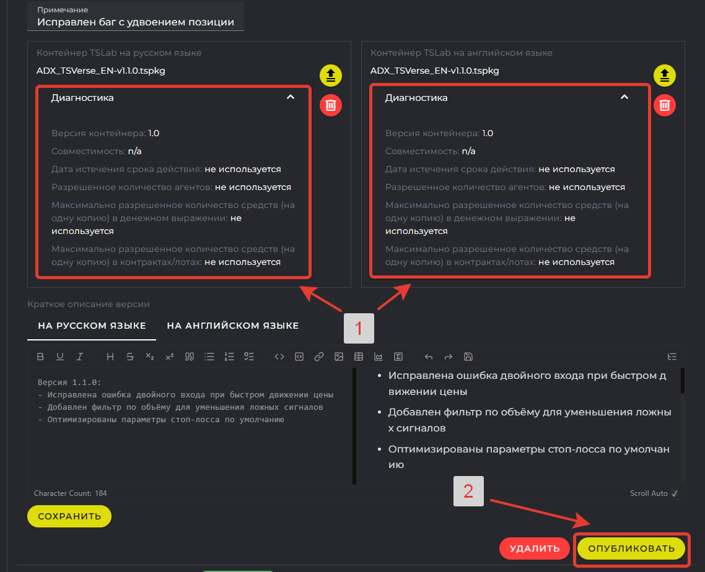
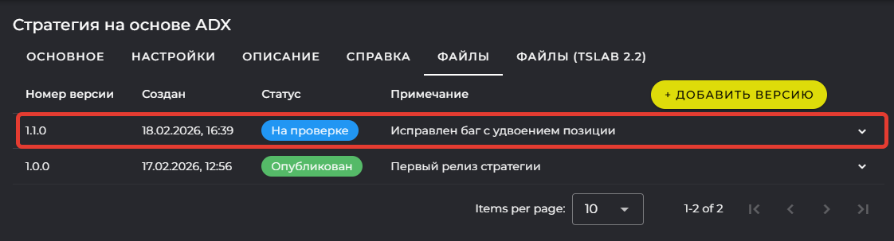

## Содержание

1. [Введение](./chast-3-upravlenie-versiyami#введение)

2. [Обновление версий](./chast-3-upravlenie-versiyami#обновление-версий)

3. [Заключение](./chast-3-upravlenie-versiyami#заключение)

---

<note title="Важно">

Все примеры в этой статье выполнены в **TSLab 3.0**. Управление версиями контейнеров поддерживается только в этой версии программы.

</note>

---

## Введение

В предыдущих частях мы создали карточку товара, прошли модерацию и опубликовали робота в маркетплейсе. Со временем вы будете улучшать стратегию: исправлять ошибки, добавлять новые функции, оптимизировать параметры. В этой статье разберём, как правильно выпускать обновления и управлять версиями.

---

## Обновление версий

### Когда выпускать обновление

Выпуск новой версии всегда остаётся на усмотрение автора. Ниже приведены типичные случаи, когда обновление необходимо:

-  Исправлена ошибка в логике стратегии

-  Добавлена новая функция или индикатор

-  Изменены параметры по умолчанию

-  Обновлена совместимость с новой версией TSLab

-  Добавлена поддержка новой биржи

<note type="tip">

Не выпускайте обновления слишком часто без существенных изменений. Каждое обновление проходит проверку модератором и требует времени на тестирование у покупателей.

</note>

### Подготовка обновлённого контейнера

Прежде чем загружать новую версию на витрину:

1. Внесите изменения в скрипт в программе TSLab

2. Протестируйте обновлённую стратегию на исторических данных

3. Проверьте корректность работы блоков "Приёмник" и "Приёмник на связи"

4. Создайте новые контейнеры (RU и EN версии)

<note type="danger">

Тщательно тестируйте обновление перед публикацией. Покупатели доверяют вам управление своими средствами.

</note>

### Загрузка новой версии

Процесс аналогичен загрузке первой версии:

1. Перейдите на вкладку **Файлы** в карточке товара

2. Нажмите **\+ Добавить версию**

   <image src="./chast-3-upravlenie-versiyami.png" crop="0,0,100,100" scale="91" width="1389px" height="462px" float="center"/>

3. Укажите новый номер версии (например, **1\.1.0**)

   <image src="./chast-3-upravlenie-versiyami-2.png" crop="0,0,100,100" scale="88" width="1387px" height="645px" float="center"/>

4. Добавьте краткое примечание для себя (например, "Исправлен баг с удвоением позиции")

5. Нажмите **ОК**

Разверните строку новой версии и перейдите на вкладку **Номер версии**:

1. Загрузите обновлённый контейнер (RU)

2. Загрузите обновлённый контейнер (EN)

3. Заполните описание изменений для покупателей (RU и EN)

   {width=1378px height=1051px}

**Пример описания изменений:**

```
Версия 1.1.0:
- Исправлена ошибка двойного входа при быстром движении цены
- Добавлен фильтр по объёму для уменьшения ложных сигналов
- Оптимизированы параметры стоп-лосса по умолчанию
```

<note>

Описание изменений увидят покупатели в уведомлении об обновлении. Пишите чётко и по делу -- что изменилось и почему это важно.

</note>

### Отправка на проверку

После загрузки контейнеров и заполнения описания:

1. Запустите **Диагностику** и убедитесь, что все параметры корректны

2. Нажмите кнопку **Опубликовать**

   {width=1138px height=924px}

3. Дождитесь проверки модератором (1-2 рабочих дня)

   {width=1122px height=303px}

### Уведомления покупателей

После одобрения новой версии модератором покупатели получат уведомление:

-  **На email:** письмо с описанием изменений

-  **В программе TSLab:** уведомление о доступности обновления

<image src="./chast-3-upravlenie-versiyami-6.png" crop="0,0,100,100" scale="87" width="1127px" height="663px" float="center"/>

### Как работает обновление у покупателя

-  Покупатель получает уведомление о новой версии

-  Решает самостоятельно: обновиться сейчас или продолжить работу на текущей версии

-  **Старая версия продолжает работать** до момента обновления

-  В программе TSLab при загрузке агента отображаются все доступные версии. 

-  Обновить агент можно только на более новую версию. Выполнить откат на предыдущую версию нельзя

<note type="tip">

В описании обновления указывайте, насколько критичны изменения. Если исправлена серьёзная ошибка -- рекомендуйте обновиться как можно скорее.

</note>

---

## Заключение

Вы прошли полный путь от идеи до публикации торгового робота на маркетплейсе TSVerse. Давайте подведём итоги всего цикла.

### Что мы разобрали в трёх статьях

**Статья 1: Обзор возможностей TSVerse**

-  Какие проблемы решает платформа для продавцов и покупателей

-  Как работает технология TSChannel

-  Два способа работы с клиентами: витрина и прямые продажи

**Статья 2: Создание защищённого торгового робота**

-  Создание проекта на TSVerse и получение Приватного API Key канала

-  Интеграция блоков "Приёмник" и "Приёмник на связи" в скрипт

-  Настройка логики: торговля только при активном подключении

-  Тестирование канала и создание защищённого контейнера

**Статья 3: Размещение на витрине TSVerse**

-  Создание карточки товара и загрузка контейнеров

-  Настройка параметров, описания и справочной информации

-  Прохождение модерации и публикация в маркетплейсе

-  Управление продажами, начислениями и обновлениями