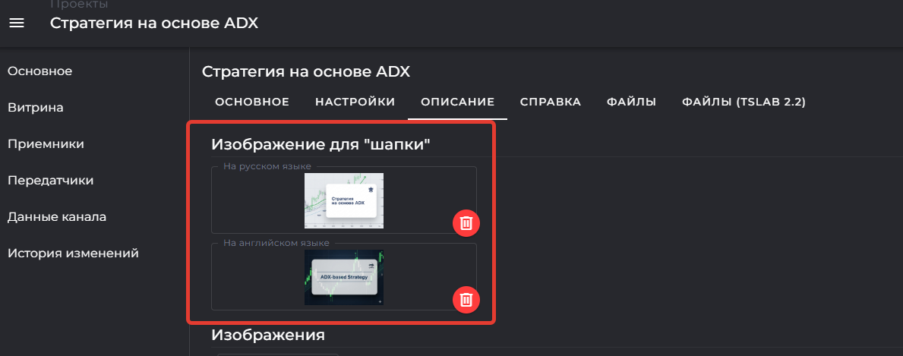

## Содержание

---

<note title="Важно: совместимость версий TSLab">

Все примеры в этом цикле статей выполнены в **TSLab 3.0**.

Контейнеры в TSLab 2.2 и TSLab 3.0 имеют разные форматы:

-  **TSLab 3.0** -- файлы с расширением `.tspkg`

-  **TSLab 2.2** -- файлы с расширением `.tszcont`

Загрузить контейнер, созданный в **TSLab 2.2**, на витрину TSVerse **нельзя**. Для размещения робота на маркетплейсе используйте только контейнеры формата `.tspkg`.

Роботов, приобретённых на витрине TSVerse, рекомендуем запускать в **TSLab 3.0** -- весь функционал платформы TSVerse разработан для работы с этой версией.

</note>

---

## Введение

Это третья статья из цикла о продаже торговых роботов через сервис TSVerse. В предыдущих материалах мы разобрали возможности платформы и подготовили защищённый контейнер для продажи.

**Что мы сделали в статье 2:**

-  Создали проект "Стратегия на основе ADX" на сайте tsverse.pro

-  Получили Приватный API Key канала для защиты робота

-  Добавили блоки "Приёмник" и "Приёмник на связи" в скрипт

-  Настроили логику: открытие позиций происходит только при активном подключении к каналу

-  Вывели статус подключения на контрольную панель

-  Протестировали связь с каналом через API ключ приёмника

-  Создали защищённые контейнеры для магазина TSVerse (русская и английская версии)

Подробнее о подготовке робота: [Создание торгового робота для маркетплейса TSVerse](./../sozdanie-torgovogo-robota-dlya-marketpleysa-tsver)

**Что разберём в этой статье:**

-  Как создать карточку товара на витрине TSVerse

-  Как загрузить контейнеры и пройти проверку

-  Как правильно оформить описание стратегии

-  Как заполнить справочную информацию для покупателей

<note type="info">

Процессы модерации, публикации и управления продажами мы разберём в следующих частях цикла.

</note>

---

## Создание карточки товара

После того как вы создали защищённый контейнер, нужно оформить карточку товара на витрине TSVerse. Это страница, которую увидят потенциальные покупатели в маркетплейсе.

**Процесс создания:**

1. Авторизируйтесь на сайте tsverse.pro

2. Перейдите в раздел **Разработка -> Проекты**

3. Откройте проект, который создали в предыдущей статье. Перейдите на вкладку **Витрина**

4. Нажмите кнопку **\+ Создать**

   <image src="./razmeschenie-torgovogo-robota-na-vitrine-tsverse.png" crop="0,0,100,100" scale="79" width="903px" height="553px" float="center"/>

5. Введите название для карточки товара (например, "ADX Strategy"). Нажмите на кнопку **Создать**

   <image src="./razmeschenie-torgovogo-robota-na-vitrine-tsverse-2.png" crop="0,0,100,100" scale="79" width="896px" height="467px" float="center"/>

<note type="info">

Это название можно будет поменять в настройках карточки торгового робота (вкладка **Настройки**).

</note>

**Обзор основных вкладок**

<image src="./razmeschenie-torgovogo-robota-na-vitrine-tsverse-3.png" crop="0,0,100,100" scale="88" width="1192px" height="706px" float="center"/>

После создания карточки вам станут доступны разделы для настройки:

-  **Основное** -- статус модерации, публикация, тестовый API ключ приёмника и приватный API Key канала

-  **Настройки** -- название робота, цена, совместимость с биржами

-  **Описание** -- тексты и изображения для карточки в маркетплейсе

-  **Справка** -- инструкции и FAQ для подписчиков

-  **Файлы** -- загрузка контейнеров и управление версиями

Теперь переходим к заполнению этих разделов.

---

## Загрузка первой версии робота

Первый шаг к публикации -- загрузка контейнеров с вашим роботом. Это нужно сделать до отправки карточки товара на модерацию.

### Создание исходной версии

1. Перейдите на вкладку **Файлы.** Нажмите кнопку **\+ Добавить версию**

   <image src="./razmeschenie-torgovogo-robota-na-vitrine-tsverse-4.png" crop="0,0,100,100" scale="78" width="1286px" height="556px" float="center"/>

2. В появившемся окне укажите:

   -  **Номер версии:** по умолчанию **1\.0.0**

   -  **Примечание:** краткое описание для себя (например, "Первый релиз стратегии"). Нажмите **ОК**

      <image src="./razmeschenie-torgovogo-robota-na-vitrine-tsverse-5.png" crop="0,0,100,100" scale="84" width="986px" height="468px" float="center"/>

<note type="info">

Это примечание видите только вы. Оно помогает отслеживать изменения между версиями в процессе разработки.

</note>

После создания версии в списке появится новая строка. Разверните её -- внутри будут две вкладки:

-  **Номер версии** -- для загрузки файлов и описания изменений

-  **История** -- сообщения о проверке модератором

### Загрузка контейнеров

<note title="Обратите внимание">

Контейнер должен быть создан в **TSLab 3.0** и иметь с расширение `.tspkg`

Файл, созданный в TSLab 2.2 и имеющий расширение `.tszcont` загрузить нельзя.

</note>

1. На вкладке **Номер версии** загрузите контейнеры:

   -  **Файл (RU)** -- контейнер с русским интерфейсом

   -  **Файл (EN)** -- контейнер с английским интерфейсом

2. Добавьте описание изменений (RU и EN):

   -  Это текст увидят покупатели при обновлении робота

   -  Для первой версии напишите краткое описание возможностей (например: "Первая версия стратегии на основе индикатора ADX")

      <image src="./razmeschenie-torgovogo-robota-na-vitrine-tsverse-6.png" crop="0,0,100,100" scale="85" width="1303px" height="1074px" float="center"/>

### Диагностика контейнера

Перед отправкой на проверку убедитесь, что контейнеры настроены правильно:

1. После загрузки файлов откройте меню **Диагностика**

2. Система проверит настройки контейнера:

   -  Версия контейнера (совместимость с TSLab 3.0)

   -  Дата истечения срока действия (должна быть снята)

   -  Разрешённое количество агентов

   -  Максимально разрешённое количество средств в денежном выражении

   -  Максимально разрешённое количество средств в контрактах/лотах

<image src="./razmeschenie-torgovogo-robota-na-vitrine-tsverse-7.png" crop="0,0,100,100" scale="80" width="1019px" height="699px" float="center"/>

<note type="danger">

Если диагностика показывает ошибки в настройках контейнера -- вернитесь к статье 2 и проверьте параметры при создании контейнера. Все ограничения должны быть сняты, кроме тех, которые критичны для вашей стратегии.

</note>

### Отправка на проверку

1. Убедитесь, что загружены оба контейнера (RU и EN)

2. Проверьте заполнение описания изменений

3. Нажмите кнопку **Опубликовать**

<image src="./razmeschenie-torgovogo-robota-na-vitrine-tsverse-8.png" crop="0,0,100,100" scale="83" width="1054px" height="773px" float="center"/>

Версия будет отправлена на проверку службой контроля качества.

**Что проверяется:**

-  Файл действительно является контейнером (не переименованный файл с расширением контейнера)

-  Версия контейнера совместима с TSLab 3.0

-  Настройки контейнера корректны

-  Описание к версии не содержит запрещённых слов

**Сроки проверки:** 1-2 рабочих дня

<note type="info">

Наша компания не вскрывает контейнеры и не проверяет алгоритм стратегии. Мы проверяем только технические параметры и оформление.

</note>

Пока версия проходит проверку, можно переходить к оформлению карточки товара.

---

## Настройка параметров

Пока контейнеры проходят проверку, настройте параметры карточки товара. Эта информация будет отображаться покупателям в маркетплейсе.

### Основные настройки

<image src="./razmeschenie-torgovogo-robota-na-vitrine-tsverse-9.png" crop="0,0,100,100" scale="83" width="1289px" height="1061px" float="center"/>

Перейдите на вкладку **Настройки** и заполните поля:

**Название робота:**

-  **Название (RU):** введите название на русском языке (например, "Стратегия на основе ADX")

-  **Название (EN):** введите название на английском языке (например, "ADX-based Strategy")

<note>

Это название увидят покупатели в маркетплейсе. Оно должно быть понятным и отражать суть стратегии.

</note>

**Цена в месяц:**

Укажите стоимость подписки в поинтах (PNT). Плата будет списываться с покупателей ежедневно равными долями.

<note type="info">

**Информация о комиссии:**

-  TSVerse удерживает комиссию **3% от стоимости**

-  Минимальная комиссия -- **1 PNT**

-  Начисления приходят на ваш внутренний счёт в момент оформлении покупателем подписки на вашу стратегию (первое списание) и затем ежедневно после 00:00 UTC

**Пример расчёта:**

-  Цена подписки: 100 PNT/месяц

-  Комиссия TSVerse: 3 PNT/месяц

-  Ваш доход: 97 PNT/месяц

-  Ежедневное списание с покупателя: \~3,33 PNT

-  Ваше ежедневное начисление: \~3,23 PNT

</note>

<note>

На данный момент цена устанавливается при создании карточки и не может быть изменена продавцом. Функционал изменения цены будет добавлен позже.

</note>

**Количество ключей приёмников:**

По умолчанию: **1**

Увеличьте значение, если ваш робот предполагает специальные сценарии использования:

-  **Несколько бирж одновременно:** покупатель может подключаться к разным поставщикам данных по одной подписке

-  **Торговля + тестирование:** на основном компьютере идёт торговля 24/7, на втором -- оптимизация параметров на исторических данных

<note type="tip">

Для большинства стратегий подходит значение **1**. Увеличивайте количество ключей только если понимаете, зачем это нужно вашим покупателям.

</note>

### Совместимость с биржами

Укажите поставщиков данных TSLab, с которыми протестирован ваш робот.

{width=1164px height=431px}

<note>

**Важное примечание от разработчиков:**

Укажите рекомендуемые поставщики данных TSLab для вашего робота. Это поможет клиентам сделать осознанный выбор и упростит настройку купленного контейнера.

Убедительно рекомендуем отнестись к выбору поставщиков осмысленно и не указывать "все подряд" только ради привлечения внимания.

На каждой бирже действуют свои правила торговли. Если внутри скрипта нет автоматического следования этим правилам, подписчик может столкнуться с проблемами: минимальный размер заявки, максимально возможная цена заявки и другие технические ограничения.

Например, не рекомендуется выбирать одновременно Binance Futures и OKX Swap, если все нюансы работы не отрабатываются внутри скрипта автоматически. Лучшим решением будет подготовка для каждой биржи отдельного робота.

</note>

### Инструменты

Укажите, с какими торговыми инструментами работает ваш робот:

**Вариант 1: Универсальный робот**

-  Поставьте галочку **Универсальный**

-  Используйте, если робот не имеет специфических настроек и может работать с любым инструментом

**Вариант 2: Конкретные тикеры**

-  Выберите тикеры из списка (например: BTCUSDT, ETHUSDT)

-  Можете добавить свой вариант -- он будет проверен при модерации

### Поддержка пользователей

Добавьте контактные данные для связи с покупателями (опционально):

-  **Email**

-  **Telegram**

-  **Сайт**

-  **Телефон**

<image src="./razmeschenie-torgovogo-robota-na-vitrine-tsverse-11.png" crop="0,0,100,100" scale="72" width="816px" height="615px" float="center"/>

<note type="tip">

Укажите хотя бы один способ связи. Это повышает доверие покупателей и помогает оперативно решать вопросы.

</note>

### Дополнительная информация

<image src="./razmeschenie-torgovogo-robota-na-vitrine-tsverse-12.png" crop="0,0,100,100" scale="74" width="1010px" height="581px" float="center"/>

Заполните справочные данные о роботе:

-  **Методы анализа** -- Технический анализ, Фундаментальный анализ, Алгоритмическая торговля

-  **Стиль торговли** -- Внутридневная торговля, Долгосрочное инвестирование, Свинг трейдинг

-  **Уровень риска** -- низкий, средний, высокий

Эти данные помогут покупателям быстрее найти подходящую стратегию в каталоге.

---

## Оформление описания

Описание -- это то, что продаёт вашего робота. Покупатель принимает решение в том числе на основе текста и изображений в карточке товара.

### Изображение для шапки

Перейдите на вкладку **Описание** и загрузите главное изображение:

1. Нажмите **Загрузить изображение для шапки**

2. Выберите файл в формате JPG, PNG или JPEG

3. Рекомендуемое соотношение сторон: **3:4** или **4:3**

{width=1189px height=469px}

**Что показать на изображении:**

-  График доходности стратегии

-  Логотип или название робота

-  Ключевые характеристики (доходность, просадка, винрейт)

<note>

Это изображение будет отображаться в списке роботов на маркетплейсе. Оно должно привлекать внимание и быть информативным.

</note>

### Дополнительные изображения

Добавьте изображения, иллюстрирующие работу робота:

1. Нажмите **Добавить изображение**

2. Загрузите файлы (JPG, PNG, JPEG)

3. Количество изображений ограничено целесообразностью (рекомендуем не более 5 штук)

<image src="./razmeschenie-torgovogo-robota-na-vitrine-tsverse-14.png" crop="0,0,100,100" scale="80" width="1079px" height="736px" float="center"/>

**Что рекомендуется показать:**

-  Результаты бэктестов с разными параметрами

-  Графики equity на разных периодах

-  Пример сделок с комментариями

-  Статистику торговли

-  Другие материалы, показывающие стратегию с выгодной стороны

<note type="tip">

Качественные скриншоты с реальными результатами работают лучше красивых, но пустых картинок.

</note>

### Краткое описание

Напишите краткую характеристику робота на **2-4 предложения**:

-  **Краткое описание (RU):** "Выжимка" основных качеств стратегии на русском

-  **Краткое описание (EN):** То же самое на английском

**Пример:**

*"Автоматическая стратегия на основе индикатора ADX для торговли криптовалютными фьючерсами. Работает в трендовых условиях с фиксированным стоп-лоссом и динамическим тейк-профитом. Средняя доходность 15-20% в месяц при просадке не более 8%."*

<note>

Краткое описание отображается в карточке товара до того, как покупатель открыл полное описание. Оно должно зацепить внимание.

</note>

### Полное описание

Напишите развёрнутое описание стратегии в формате **Markdown**. Текст можно форматировать, вставлять ссылки и изображения.

**Рекомендуемая структура описания:**

**1\. Введение** -- зацепите читателя конкретной цифрой или уникальным преимуществом в первом предложении.

*Пример:* "Стратегия показала доходность +127% за последние 6 месяцев на паре BTC/USDT с максимальной просадкой 12%."

**2\. О системе** -- методология, опыт разработчика, что отличает от конкурентов.

**3\. Технические характеристики** -- список поддерживаемых бирж, типы рынков (Spot / Perpetual / Futures), основа алгоритма, рекомендуемые таймфреймы.

**4\. Управление рисками** -- механизмы защиты капитала, условия автоматической остановки, максимальная просадка.

**5\. Бэктест** -- глубина исторических данных, начальный депозит при тестировании, ключевые метрики (винрейт, профит-фактор, коэффициент Шарпа).

**6\. Условия подключения** -- минимальный рекомендуемый депозит, критичные настройки перед запуском, пошаговая инструкция первого запуска (3-5 шагов).

**7\. Мониторинг** -- главный индикатор работоспособности, где смотреть текущие позиции, как понять что робот работает корректно.

**8\. Поддержка** -- куда обращаться с вопросами, время ответа, наличие обучающих материалов.

**9\. Юридическое предупреждение** -- обязательно добавьте предупреждение о рисках, например:

*"Торговля на финансовых рынках сопряжена с высоким уровнем риска и может привести к потере всего капитала. Прошлые результаты не гарантируют будущей доходности. Используйте робота только на средства, потерю которых вы можете себе позволить. Разработчик не несёт ответственности за финансовые результаты использования стратегии."*

**10\. Скриншоты и доказательства** -- вставьте скриншоты результатов, добавьте ссылки на внешние источники, можно вставить видео с демонстрацией работы.

<note type="tip">

Пишите простым языком. Избегайте сложных технических терминов без пояснений. Покупатели с разным уровнем опыта должны понимать, как работает ваш робот.

</note>

---

## Справочная информация

Раздел **Справка** содержит детальные инструкции по настройке и работе с роботом. Эта информация будет видна **только покупателям**, оформившим подписку.

### Зачем нужна справка

Даже если вы подробно описали стратегию в карточке товара, у покупателей возникнут вопросы:

-  Как правильно настроить параметры под свой депозит?

-  Что делать, если робот не открывает позиции?

-  Как обновить робота на новую версию?

-  Какие настройки критичны, а какие можно менять?

Качественная справка снижает количество обращений в поддержку и повышает удовлетворённость покупателей.

### Что включить в справку

Перейдите на вкладку **Справка** и добавьте следующие разделы:

**1\. Первоначальная настройка**

Пошаговая инструкция для тех, кто только купил робота:

1. Как загрузить контейнер в TSLab

2. Какие параметры обязательно нужно настроить перед запуском

3. Как проверить подключение к каналу TSVerse

4. Рекомендуемый размер депозита для старта

5. Настройка торговых параметров под свой риск-профиль

**2\. Описание параметров**

Таблица с расшифровкой всех настраиваемых параметров робота:

<table header="row">
<colgroup><col width="167"/><col width="260"/><col width="260"/></colgroup>
<tr>
<td>

Параметр

</td>
<td>

Описание

</td>
<td>

Рекомендуемое значение

</td>
</tr>
<tr>
<td>

Period ADX

</td>
<td>

Период расчёта индикатора

</td>
<td>

14

</td>
</tr>
<tr>
<td>

ADX Threshold

</td>
<td>

Порог входа в позицию

</td>
<td>

25

</td>
</tr>
<tr>
<td>

Stop Loss %

</td>
<td>

Размер стоп-лосса

</td>
<td>

2%

</td>
</tr>
<tr>
<td>

Take Profit %

</td>
<td>

Размер тейк-профита

</td>
<td>

5%

</td>
</tr>
</table>

**3\. Часто задаваемые вопросы (FAQ)**

Соберите типичные вопросы и дайте на них развёрнутые ответы. Пример:

**Вопрос:** Робот не открывает позиции. Что делать?

**Ответ:**

1. Проверьте статус подключения на контрольной панели -- должно быть "Подключён"

2. Проверьте, что на счету достаточно средств для открытия минимальной позиции

3. Посмотрите сообщения в «Журнале уведомлений»-- там могут быть ошибки подключения к бирже

**Вопрос:** Как часто нужно обновлять робота?

**Ответ:** Обновления выходят по мере необходимости (исправление ошибок, добавление функций). Вы получите уведомление на email и увидите сообщение в программе TSLab. Старая версия продолжит работать, обновление -- на ваше усмотрение.

**Вопрос:** Можно ли запускать робота на нескольких инструментах одновременно?

**Ответ:** Да, создайте несколько агентов в TSLab с разными инструментами. Каждый агент будет торговать независимо.

**4\. Решение типичных проблем**

| Проблема                                 | Причина                                     | Решение                                                                |
|------------------------------------------|---------------------------------------------|------------------------------------------------------------------------|
| Статус "Отключён" на панели              | Истекла подписка                            | Проверьте баланс в личном кабинете TSVerse                             |
| Ошибка "Недостаточно средств"            | Депозит меньше минимального размера позиции | Пополните счёт или уменьшите размер позиции в настройках               |
| Позиции закрываются сразу после открытия | Неправильные настройки стоп-лосса           | Проверьте параметр Stop Loss % -- должно быть разумное значение (2-5%) |

**5\. Рекомендации по использованию**

-  Начинайте с минимального депозита для тестирования стратегии

-  Не изменяйте сразу все параметры -- меняйте по одному и отслеживайте результат

-  Ведите дневник сделок -- это поможет понять, как работает стратегия

-  Не запускайте робота на весь депозит в первый день

**6\. Контакты поддержки**

Укажите, как с вами можно связаться:

-  **Telegram:** @your_username

-  **Email:** support@yourrobot.com

-  Отвечаю в течение 24 часов (в рабочие дни)

<note type="tip">

Чем подробнее справка, тем меньше вопросов придёт в поддержку. Инвестируйте время в её качественное оформление.

</note>

---

## Завершение подготовки

Вы заполнили все необходимые разделы карточки товара:

-  Загрузили контейнеры и отправили их на техническую проверку

-  Настроили параметры робота (название, цена, совместимость)

-  Оформили описание для покупателей

-  Подготовили справочную информацию

**Что дальше?**

Теперь необходимо дождаться ответа от модераторов о результатах проверки контейнеров. Проверка занимает 1-2 рабочих дня. Статус проверки можно посмотреть на вкладке **Файлы -> История**.

После одобрения контейнеров можно будет отправить карточку товара на модерацию. О том, как это сделать правильно, мы подробно расскажем в следующей статье.

  

<note type="tip">

Пока идёт проверка контейнеров, вы можете дополнительно проверить тексты описания, добавить скриншоты или улучшить справочную информацию.

</note>

  

---

## Итоги первой части

В этой статье мы выполнили:

1. Создали карточку товара на витрине TSVerse

2. Загрузили исходную версию контейнера (RU и EN) и прошли диагностику

3. Настроили параметры робота: название, цену, совместимость с биржами

4. Оформили описание стратегии с изображениями и текстом

5. Подготовили справочную информацию для покупателей

### Что дальше

В следующей статье **"Часть 2: Модерация и публикация"** мы рассмотрим:

1. Как проверить готовность карточки товара перед отправкой на модерацию

2. Процесс модерации карточки и типичные замечания

3. Публикацию робота в маркетплейсе TSVerse

4. Управление продажами и отслеживание начислений

5. Вывод заработанных средств