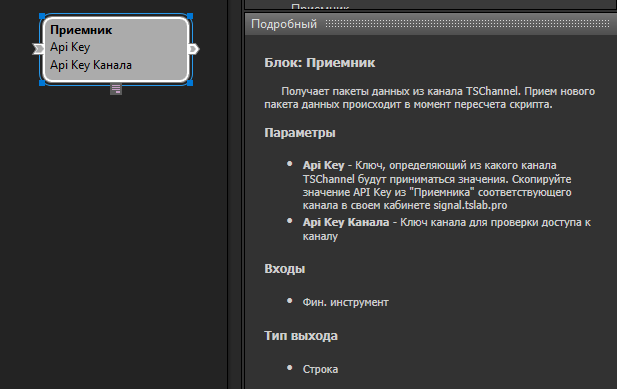
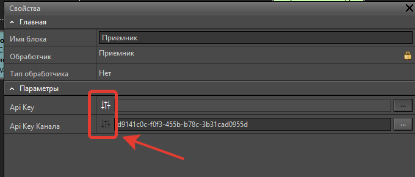

## Содержание:

-  Введение

-  Создание проекта на TSVerse

-  Блоки "Приёмник" и "Приёмник на связи": краткое описание

-  Подготовка скрипта к размещению на витрине TSVerse

-  Тестирование работы канала

-  Создание контейнера для размещения на витрине TSVerse

-  Заключение

---

<note title="Важно: совместимость версий TSLab">

Все примеры в этом цикле статей выполнены в **TSLab 3.0**.

Контейнеры в TSLab 2.2 и TSLab 3.0 имеют разные форматы:

-  **TSLab 3.0** -- файлы с расширением `.tspkg`

-  **TSLab 2.2** -- файлы с расширением `.tszcont`

Загрузить контейнер, созданный в **TSLab 2.2**, на витрину TSVerse **невозможно**. Для размещения робота на маркетплейсе используйте только контейнеры формата `.tspkg`.

Роботов, приобретённых на витрине TSVerse, рекомендуем запускать в **TSLab 3.0** -- весь функционал платформы TSVerse разработан для работы с этой версией.

</note>

---

## Введение

В предыдущей статье мы рассмотрели, какие возможности открывает витрина TSVerse для продавцов и покупателей торговых роботов. Теперь переходим к практике: как подготовить вашего робота к размещению в магазине.

В этой статье мы разберём самый простой сценарий работы с TSVerse -- продажу готового торгового робота, упакованного в защищённый контейнер. Технология TSChannel обеспечивает не только защиту от несанкционированного использования, но и открывает удобный способ распространения ваших стратегий среди широкой аудитории.

**Что выполним в рамках этой статьи:**

-  Создадим проект на платформе TSVerse

-  Интегрируем блоки TSChannel в свой скрипт

-  Подготовим защищённый контейнер, готовый к размещению на витрине

Для примера мы возьмём один из бесплатных скриптов, доступных в TSLab, и покажем, как его доработать для продажи через TSVerse. Мы не будем касаться торговой логики самого скрипта -- акцент только на работе с новыми блоками для интеграции с платформой.

---

## Создание проекта на TSVerse

Первый шаг к размещению робота на витрине -- создание проекта на сайте TSVerse.

### Что такое проект

Проект в TSVerse -- это панель управления вашей торговой стратегией и его распространением среди покупателей.

Через проект вы можете:

-  Управлять продажами стратегий на витрине TSVerse

-  Создавать распределенные торговые системы

Вы можете доверить управление подписками сервису TSVerse через витрину или администрировать передатчики и приёмники самостоятельно. В обоих случаях проект остаётся центром контроля над распространением вашего робота.

Вы можете создать неограниченное количество проектов бесплатно.

### Процесс создания проекта

Войдите в личный кабинет на сайте [tsverse.pro](http://tsverse.pro). Перейдите в раздел **Разработка -> Проекты**

<image src="./sozdanie-torgovogo-robota-dlya-marketpleysa-tsver.png" crop="0,0,100,100" scale="94" width="1121px" height="381px" float="center"/>

Нажмите кнопку **Создать**

<image src="./sozdanie-torgovogo-robota-dlya-marketpleysa-tsver-2.png" crop="0,0,100,100" scale="94" width="1121px" height="394px" float="center"/>

Введите название проекта (например, "Стратегия на основе ADX"). Нажмите **Создать**

<image src="./sozdanie-torgovogo-robota-dlya-marketpleysa-tsver-3.png" crop="0,0,100,100" scale="84" width="758px" height="417px" float="center"/>

После создания проекта система автоматически генерирует **Приватный API Key канала** -- это ключ, который понадобится для настройки блоков в вашем скрипте.

### Разделы проекта

После создания проекта вам становятся доступны несколько разделов для управления:

<image src="./sozdanie-torgovogo-robota-dlya-marketpleysa-tsver-4.png" crop="0,0,100,100" scale="84" width="1279px" height="456px" float="center"/>

**Основное**

Здесь собрана ключевая информация о проекте:

-  **Номер контракта** -- служебная информация для обращения в поддержку

-  **Дата создания** -- когда был создан проект

-  **Приватный API Key канала** -- используется для настройки блоков приёмников в контейнерах. Защищает ваши стратегии от несанкционированного использования. Этот ключ понадобится при настройке скрипта

-  **Статус** -- активен или неактивен проект.

-  **Сервисный режим** -- когда канал находится в сервисном режиме, данные от передатчиков не принимаются. Используйте этот режим при внесении изменений в передающие скрипты и агенты

<note title="Важно  ">

**Приватный API Key канала** из раздела **"Основное"** понадобится на следующем этапе.

</note>

**Витрина**

Раздел для оформления и размещения робота на продажу. Подробно этот процесс мы разберём в следующей статье.

**Приёмники**

Список всех Приёмников, созданных для проекта. Используются для настройки скриптов и получения данных от Передатчиков.

**Передатчики**

Список всех передатчиков для проекта. Используется в продвинутых сценариях работы с TSChannel, когда робот передаёт торговые сигналы от одного компьютера к другому. В нашем примере не используется.

**Данные канала**

В продвинутых сценариях работы торгового робота могут передавать данные от передатчика к приёмнику: расчёты, сигналы, другие виды данных, необходимые для работы торгового робота у клиента. Здесь можно посмотреть значения этих данных. В нашем примере не используется.

**История изменений**

Показывает все изменения проекта: создание, активацию, деактивацию и другие действия.

---

## Блоки "Приёмник" и "Приёмник на связи": краткое описание

Для интеграции вашего скрипта с TSVerse используются два специальных блока из панели инструментов визуального редактора.

### Блок "Приёмник"

{width=617px height=389px}

**Назначение:** Получает пакеты данных из канала TSChannel. Прием нового пакета данных происходит в момент пересчета скрипта.

**Основные параметры:**

-  **API Key** -- индивидуальный ключ для каждого покупателя. На этапе разработки оставляется пустым. После продажи через витрину TSVerse заполняется автоматически

-  **API Key канала** -- Приватный API Key канала из раздела "Основное" вашего проекта. Этот ключ постоянный для всего проекта и защищает робота от несанкционированного использования

<note title="Важно">

**Приватный API Key канала** -- это конфиденциальные данные. Не передавайте этот ключ другим пользователям.

</note>

### Блок "Приёмник на связи"

{width=634px height=288px}

**Назначение:** Проверяет активность подписки и наличие связи с каналом TSVerse.

**Принцип работы:** Блок возвращает логическое значение (true/false) в зависимости от статуса подключения:

-  **true** -- связь установлена и блокировок нет

-  **true** -- связь прервалась, но блокировок не было (работает с задержкой 5 минут)

-  **false** -- связи не было никогда (значение по умолчанию)

-  **false** -- есть связь, но установлена блокировка (например, истекла подписка)

**Задержка при блокировке:** При блокировке приёмника на сайте блок переходит в состояние false с задержкой 5 минут. При активации приёмника блок сразу возвращает true.

**Использование:** Блок играет роль флага, который показывает, что связь с сервером TSVerse установлена и торговый робот не заблокирован автором. Обычно используется как одно из условий для разрешения открытия позиции.

---

## Подготовка скрипта к размещению на витрине TSVerse

Теперь приступим к практической настройке скрипта. Мы возьмём готовый скрипт и добавим в него блоки для работы с TSVerse.

### Открытие скрипта в редакторе

1. Откройте программу TSLab

2. Перейдите в **Лаб -> Скрипты**

3. Выберите скрипт, который планируете продавать

4. Откройте его в визуальном редакторе

Для примера мы используем один из бесплатных скриптов, доступных для скачивания в программе. Торговую логику менять не будем -- только добавим интеграцию с TSVerse.

### Добавление блоков TSChannel

1. В панели инструментов найдите блоки **"Приёмник"** и **"Приёмник на связи"**

2. Перетащите оба блока на рабочую область редактора

### Подключение блока "Приёмник"

Блок "Приёмник" необходимо подключить к источнику данных:

-  Соедините блок **"Торгуемый инструмент"** с входом блока **"Приёмник"**

Это необходимо для регистрации подключения к каналу и получения данных инструмента.

<image src="./sozdanie-torgovogo-robota-dlya-marketpleysa-tsver-7.png" crop="0,0,100,100" scale="85" width="1109px" height="851px" float="center"/>

### Настройка параметров блока "Приёмник"

1. Откройте свойства блока **"Приёмник"** (двойной клик на блоке)

2. Найдите поле **API Key канала**

3. Вставьте **Приватный API Key канала**, который вы сохранили при создании проекта на TSVerse

4. Поле **API Key** оставьте пустым -- оно будет заполняться автоматически для каждого покупателя

   <image src="./sozdanie-torgovogo-robota-dlya-marketpleysa-tsver-8.png" crop="0,0,100,100" scale="92" width="1280px" height="714px" float="center"/>

<note title="Важно">

Рядом с полем **API Key канала** есть кнопка в виде эквалайзера. Убедитесь, что она **неактивна** (выключена). Это защитит параметр от изменения пользователями.

</note>

### Подключение блока "Приёмник на связи"

1. Соедините выход блока **"Приёмник"** с входом блока **"Приёмник на связи"**

2. Подключите выход блока **"Приёмник на связи"** к вашей торговой логике

**Типичная схема подключения:**

Блок "Приёмник на связи" используется как одно из условий для входа в позицию. Логика работы выглядит так:

`(Условия стратегии) И (Приёмник на связи) = Разрешение на открытие позиции`

Например, если в вашем скрипте используется блок **"Логическая формула"** для проверки условий входа, подключите "Приёмник на связи" как одно из условий в эту формулу.

<image src="./sozdanie-torgovogo-robota-dlya-marketpleysa-tsver-9.png" crop="0,0,100,100" scale="86" width="771px" height="608px" float="center"/>

<note type="lab" title="Примечание">

Это только один из возможных вариантов применения блока "Приёмник на связи". Вы можете реализовать свою логику в зависимости от задач вашей стратегии.

</note>

### Опциональная визуализация статуса подключения

Для удобства пользователей вашего робота можно добавить визуальную индикацию статуса подключения к каналу TSVerse.

**Что потребуется:**

-  Блок **"Строковая формула"**

-  Блок **"Контрольная панель"**

**Процесс настройки:**

1. Добавьте блок **"Строковая формула"** на рабочую область

2. Подключите выход блока **"Приёмник на связи"** к входу блока **"Строковая формула"**

3. В параметрах блока "Строковая формула" настройте вывод текста:

   `ПриёмникНаСвязи ? "Подключён" : "Отключён"`

4. Добавьте блок **"Контрольная панель"** на рабочую область

5. Соедините выход блока **"Строковая формула"** с блоком **"Контрольная панель"**

6. Откройте редактор панели блока **"Контрольная панель"**. Перетащите на полотно элемент **"Строковая формула".**

<image src="./sozdanie-torgovogo-robota-dlya-marketpleysa-tsver-10.png" crop="0,0,100,100" scale="82" width="1277px" height="740px" float="center"/>

Теперь при работе робота пользователь будет видеть на контрольной панели текущий статус подключения к каналу: "Подключён" или "Отключён".

<note type="lab" title="Примечание">

Визуализация статуса -- это опциональная функция. Она удобна для пользователей, но не обязательна для работы робота.

</note>

### Настройка доступа к параметрам

Перед экспортом контейнера необходимо правильно настроить доступ к параметрам блока "Приёмник":

**API Key:**

-  Рядом с полем есть кнопка в виде эквалайзера

-  Убедитесь, что кнопка **активна** (включена)

-  Это позволит автоматически заполнять ключ для каждого покупателя

**API Key канала:**

-  Рядом с полем есть кнопка в виде эквалайзера

-  Убедитесь, что кнопка **неактивна** (выключена)

-  Это защитит ваш приватный ключ от изменения

{width=680px height=290px}

---

## Тестирование работы канала

Перед созданием контейнера необходимо убедиться, что связь с каналом TSVerse работает корректно.

### Процесс тестирования

**1\. Получение тестового API ключа приёмника**

1. Откройте страницу вашего проекта на сайте [tsverse.pro](http://tsverse.pro)

2. Перейдите в раздел **Приёмники**

3. Скопируйте API ключ одного из приёмников

   <image src="./sozdanie-torgovogo-robota-dlya-marketpleysa-tsver-12.png" crop="0,0,100,100" scale="92" width="1280px" height="427px" float="center"/>

**2\. Настройка блока "Приёмник" для тестирования**

1. Откройте параметры блока **"Приёмник"** в вашем скрипте

2. Найдите кнопку-эквалайзер рядом с полем **API Key**

3. **Отключите** эту кнопку (сделайте неактивной)

4. Вставьте в поле **API Key** скопированный API ключ приёмника

   {width=1153px height=573px}

**3\. Запуск и проверка**

1. Запустите скрипт на исторических данных или в режиме реального времени

2. Убедитесь, что блок **"Приёмник"** устанавливает связь с каналом

3. Проверьте, что блок **"Приёмник на связи"** возвращает значение true

4. Если настроена визуализация -- убедитесь, что на контрольной панели отображается статус "Подключён"

   {width=1109px height=621px}

**4\. Возврат настроек после тестирования**

<note title="Важно">

После успешной проверки необходимо вернуть настройки в исходное состояние:

</note>

1. Откройте параметры блока **"Приёмник"**

2. **Очистите** поле **API Key** (удалите тестовый ключ)

3. **Активируйте** кнопку-эквалайзер рядом с полем **API Key**

   {width=680px height=290px}

---

## Создание контейнера для размещения на витрине TSVerse

После успешного тестирования можно приступить к созданию защищённого контейнера, который будет доступен покупателям.

### Настройка торговых параметров

Перед созданием контейнера рекомендуется настроить торговые параметры в соответствии с логикой вашей стратегии.

{width=495px height=716px}

### Процесс создания контейнера

1. Перейдите в окно **Скрипты**

2. Выделите нужный скрипт в списке

3. Нажмите кнопку **Создать контейнер**

### Настройки экспорта контейнера

В окне создания контейнера обратите внимание на следующие параметры:

**Ключ счёта:**

-  **Не указывайте** ключ счёта

-  Каждый покупатель будет использовать свой собственный торговый счёт

**Дата окончания:**

-  **Снимите галочку** с поля "Дата окончания"

-  Ограничение доступа к контейнеру будет регулироваться через систему подписок TSVerse, а не датой истечения

**Применение оптимизации:**

-  Настройте в соответствии с вашей стратегией

-  Решите, будут ли покупатели иметь доступ к оптимизации параметров

**Доступ к торговым настройкам:**

-  Определите, какие параметры покупатели смогут изменять

-  Заблокируйте критически важные параметры, если необходимо

<image src="./sozdanie-torgovogo-robota-dlya-marketpleysa-tsver-17.png" crop="0,0,100,100" scale="94" width="1104px" height="628px" float="center"/>

### Сохранение контейнера

1. Задайте имя файла контейнера

2. Выберите папку для сохранения

3. Нажмите **Создать**

Контейнер будет сохранён в формате защищённого файла с расширением **.tspkg**

### Подготовка версий для разных языков

TSVerse -- это мультиязычная платформа. Для размещения на витрине потребуется подготовить **две версии контейнера**: с русским и английским интерфейсом.

**Что нужно перевести:**

Весь текст, который видит пользователь вашего робота:

-  Надписи на контрольной панели (например, "Подключён" / "Connected")

-  Названия параметров, доступных для настройки

-  Любые текстовые элементы интерфейса

**Процесс создания двух версий:**

1. Создайте контейнер с русским интерфейсом (например, Robot_RU.tspkg)

2. Создайте копию скрипта. Выполните перевод надписей на английский язык

3. Создайте второй контейнер с английским интерфейсом (например, Robot_EN.tspkg)

Оба контейнера понадобятся при оформлении робота на витрине -- об этом подробнее в следующей статье.

<note type="info">

**Что дальше:** Теперь у вас есть готовый контейнер, который можно разместить на витрине TSVerse. Процесс размещения и настройки продажи мы подробно разберём в следующей статье.

</note>

---

## Заключение

Вы научились создавать защищённый торговый робот для размещения на витрине TSVerse.

**Ключевые моменты:**

-  Приватный API Key канала защищает вашего робота от несанкционированного использования

-  Блок "Приёмник на связи" контролирует доступ к торговле в зависимости от статуса подписки

-  Тестирование перед экспортом помогает убедиться в корректной работе всех компонентов

-  Правильная настройка параметров контейнера критична для успешной продажи

### Что дальше: Статья 3

В следующей статье мы разберём:

-  Как разместить робота на витрине TSVerse

-  Как правильно составить описание стратегии для робота

-  Как управлять версиями и обновлениями робота

-  Как работать с подписками и анализировать продажи

-  Как пройти модерацию и запустить продажи

После изучения третьей статьи ваш робот будет доступен тысячам потенциальных покупателей на витрине TSVerse.

**Следите за обновлениями!**

---

## Обратная связь и поддержка

**Обсудить TSLab 3.0:**

Присоединяйтесь к обсуждению новой версии в нашей группе Telegram: <https://t.me/tslabprorugroup>

**Техническая поддержка:**

Все вопросы направляйте в службу поддержки: <https://support.tsverse.pro>

Ваши отзывы и предложения помогают нам сделать TSLab лучше!